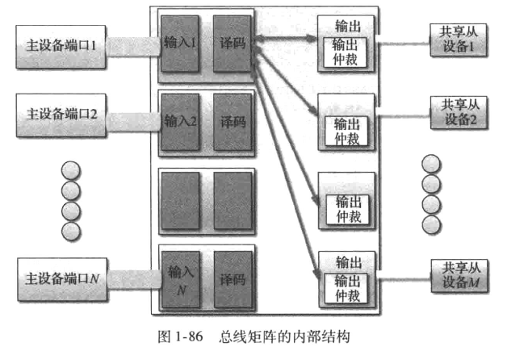
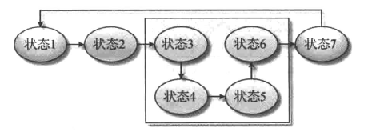

# 一、集成电路设计与HDL
## 1.1 复杂逻辑模块的设计

逻辑电路的**复杂性**通常表现在一下几个方面：
> 1.内部结构组成复杂
> 2.控制状态复杂且高度耦合
> 3.接口复杂且信号数量很多
> 4.模块数量巨大

而对于任何复杂的逻辑设计最终可以演变为：
> 1.对基本单元的归类整理和层次化设计，即结构化设计；
> 2.基本功能的单元设计，即数据流设计；
> 3.将层次化的基本单元进行梳理，最终形成全局电路控制，即控制流设计。

### 1.1.1 结构化的设计
> 芯片结构化设计中最重要的一点：**如何定义整体结构以及划分单元间的边界**。
- 架构划分的出发点通常包含：
  - 能够改善模块的独立性和并行性
  - 改善EDA工具的运行时间或优化难度；
  - 减少设计实现的面积；
- 改善模块的独立性和并行性的本质：**增加吞吐量，并降低设计难度**，其关键在于对模块进行解耦，并对模块接口协议进行规范化。

<div align="center"><p>图 0</p></div> 

上图为M个模块输出数据给N个模块，这是一种典型的强耦合结构，不符合工程设计所要求的“高内聚，低耦合”和“信息隐蔽”的基本原则。

#### 1.1.1.1 结构化设计分类
##### 1.1.1.1.1 顺序结构（数据流模型）

<div align="center"><p>图 1</p></div> 

各个模块的输入、输出均独立，互不干扰，数据和控制解耦最完全，能实现最大吞吐率和最大并行化，这也是设计中首要最求的目标。

##### 1.1.1.1.2 树状结构（数据分发与汇聚模型）

<div align="center"><p>图 2</p></div> 

模块间只存在一个汇聚点，而子模块相互独立，互不干扰。整个树状结构只能由汇聚点输入或输出，整体充当一个节点与其他模块互联。
该结构适合在叶子节点较少时选用，单同样存在单点变化会对周边模块功能和时序造成影响的问题，因此需要指定规则以保证在节点调整时，上下两层能够防止这种影响的扩散，而仅需局部调整应对。

##### 1.1.1.1.3 总线结构（总线模型）

<div align="center"><p>图 3</p></div> 

上层的M个模块可以相互独立，并能够独立做任意修改，只要接口界面满足总线汇聚标准即可；而用于承接的N个模块也不关心输入源头，同样只需满足总线汇聚规范即可。

#### 1.1.1.2 结构化设计要点
1. 数据与控制分离
在IC设计中，将数据的处理模块和控制的状态机分开的好处在于：
- 数据结构相对简单，调试比较方便；
- 数据流可以专门设计，并大量使用成熟IP；
- 对于综合工具而言，分离结构层次清晰，FSM易于提取，因此结构优化彻底；

2. 将相思逻辑或紧密关联逻辑划分到相同层次

- 不够理想的层次结构
<div align="center"><p>图 4</p></div> 

- 优化后的层次结构
<div align="center"><p>图 5</p></div> 

- 层次优化后的区别
<div align="center"><p>图 6</p></div> 

1. 使用寄存器作为模块的分界线
   
<div align="center"><p>图 7</p></div> 
不理想的原因：综合工具在综合时将有限考虑组合电路B和组合电路C各自的优化，很难站在全局角度将电路B和C进行合并优化。此外，综合工具的优化能力有限，如果按照保守约束方法进行输入、输出判断，最终模块1和模块2之间的时序很难满足要求。

<div align="center"><p>图 8</p></div> 
利用寄存器作为模块设计的边界，综合工具无须考虑模块边界，只需专注于组合电路的优化。而且当组合电路AB被修改后，并不影响组合电路CD的综合结果。

### 1.1.2 数据流的设计

前级数据产生模块为生产者，数据处理模块为消费者。

<div align="center"><p>图 9</p></div> 

生产者与消费者模型的核心就是**既不能让生产者爆仓，生成过多产品，又不能让任何一个消费者饿死**。

借鉴生产者与消费者模型的接口协议，**以数据传递是否存在控制协议以及是否成帧作为划分的**基础，**数据流接口**可以划分为：
1. 无流控输入
2. 有流控输入
3. 无流控输出
4. 有流控输出
5. 数据块传递（成帧传递）

对于IC电路中一对多与多对一的情况，可以通过**添加控制逻辑**，将此类模型简化为一对一的数据流模型：
<div align="center"><p>图 10</p></div> 

#### 1.1.2.1 无流控输入/输出
> 无流控输入/输出就是信号直通，输入与输出之间的速率能够完全匹配，如下图所示。

<div align="center"><p>图 11</p></div> 

只有输入频率、相位与模块要求的输入一直，才能将接口设计作为无流控输入。但由于对外部的要求最高，所以无流控输入的移植性最差。无流控输出作为无流控输入的配对，只要输出信号能够在规定的时刻保持数据稳定即可。

#### 1.1.2.2 有流控输入/输出
> 有流控输入就是在输入数据的用时伴随着控制协议或约束。
> 接收方根据当前的缓存状态或其他标志确认是否继续接收新的数据或者通知发送方暂缓发送。
> 流控的本质是保证输入模块的长时平均速率与输出模块的长时平均速率完全相等。如果两者的速率不匹配，就需要添加额外的数据缓存，或者采用交互方式。

<div align="center"><p>图 12</p></div> 

> 被动流控：通过事先计算出最大流量差，设置需要的最大缓存（FIFO、RAM），输入、输出双方都无须关心是否存在缓存过满或数据不足的情况；
> 主动流控：通过请求（enable）信号和下游输入通过允许使能（grant）信号进行交互，形成主动数据交互。

##### 1.1.2.2.1 被动流控

<div align="center"><p>图 13</p></div> 

<div align="center"><p>图 14</p></div> 

##### 1.1.2.2.2 主动流控
> 主动流控是指收发两方遵守一定的协议规定，通过交互实现数据的可靠传递。
> 这类交互通常包括一个读写状态指示（相当于读写请求）、数据是否准备好（相当于READY信号）和读写周期结束信号。

#### 1.1.2.3 数据流的总线接口
前面两种流控方式（主动、被动）适合局部电路设计，而一旦信号数量很多，且面对多个设备时，就需要采用总线形式的接口。

> 常见的总线形式包括：Local Bus、AMBA（AHB/AXI等）、CoreConnect、Wishbone等。
> Local Bus就是将所有的部件充当存储器或IO方式访问；
> AHB/AXI则是目前SoC芯片的事实总线标准；
> CoreConnect主要在IBM与Freescale（NXP）的芯片中使用；
> Wishbone则主要用于开源系统，例如Opencores的设计中。

#### 1.1.2.4 总线效率与DMA
##### 1.1.2.4.1 总线矩阵设计
通过总线矩阵，多个AMBA主设备可以并行访问多个不同的从设备，而不会发生冲突，其中关键在于内部的矩阵开关确定了哪个主设备可以访问哪个从设备，并安排它们之间的控制信号和数据信号的通路。

<div align="center"><p>图 15</p></div> 

> 在总线矩阵中，总线层次结构确定后，决定传输性能的关键是**仲裁机制**。仲裁机制决定了总线访问的延迟时间与总体吞吐量。
> 常见的仲裁机制包括：
> Fixed仲裁（固定优先级）：一个端口总是具有最高的优先级，其他端口的优先级是确定的。
> Fixed（突发）仲裁：与Fixed仲裁相思，但不会打断固定长度突发传输，通常设定为总线矩阵的默认仲裁机制。
> Round robin仲裁（轮询仲裁）：如果有端口在等待，在各个传输之间进行转换。（最高优先级得到了grant之后，就会变成最低优先级）

##### 1.1.2.4.2 DMA操作
DMA控制器是**针对总线特点设计的数据搬移专用电路**，可以完成外设至内存、内存至外设、内存至内存的三方数据直接转移。
- DMA实现过程只有简单3步：
  - 从外设数据寄存器或者从DMA内部寄存器指定地址的存储器单元以执行加载操作；
  - 将数据存储到外设数据寄存器或者存储数据到DMA内部寄存器指定地址的存储器单元；
  - 使DMA内部技术寄存器（该寄存器包含未完成的操作数目）进行递减操作，计数器归0时，完成一次DMA操作。

### 1.1.3 控制流的设计

在IC设计中，控制流的设计可以认为是有限状态机的设计。通过状态机可以完成系统控制、接口读写控制、协议解析等功能。

状态机的设计与数据流的设计方法类似，核心就是**状态解耦**。将复杂的状态机进行拆分，按照结构化的方法进行设计。

#### 1.1.3.1 主从状态机

- 例1：
无层次划分的状态机：
<div align="center"><p>图 16</p></div> 

主从状态机的实现方法：
<div align="center"><p>图 17</p></div> 

- 例2：
带有内部环路的状态机：
<div align="center"><p>图 18</p></div> 

内部环路状态机的拆分结果：
<div align="center"><p>图 19</p></div> 

在主从状态机设计中，存在一个主从相互等待的问题。由于主机、从机通常不清楚对方的状态，所以需要用到流控机制，即主状态机只有在从状态机非 Busy状态时，即IDLE状态时，才可以发出从状态机启动信号 Start。从状态机收到启动信号 Start后开始运行，并在下一时钟沿发出 Busy信号，此时需要将从机已启动的状态通知给主状态机。当从机启动执行后，需要检测主机是否撤销了从机的启动命令。如果从机执行完毕后，主机还未撤销启动，则从机需要等待主机撤销启动命令后才能进入IDLE状态；如果主机已经撤销，则可以直接进入IDLE状态。这种交互模式**保证了主、从状态机的安全可靠**。

#### 1.1.3.2 主从状态机的并行化设计

<div align="center"><p>图 20</p></div> 

这种主从状态机设计的关键在于**各个从状态机可控，且执行周期大致相同**。主机在超级状态1时，启动所有并行从状态机，然后主机经过一系列的状态后，进入超级状态2，此时将依次等待各个状态机的结束。

> 由于并行主从状态机存在状态失控的危险，所以有限状态机必须设计看门狗电路，或者主机能够强行关闭从状态机，从而保证有限状态机能顺利完成状态转移。

---

## 1.2 HDL电路设计技巧
### 1.2.1 芯片设计的核心目标
#### 1.2.1.1 运行速度
> 运行速度，包括整个系统的吞吐率和时钟频率
> 吞吐率：指单位时间内系统所能处理的数据量。（简单来说，主频*核心数=吞吐率。）

#### 1.2.1.2 硬件资源消耗（面积）
> 资源占用，包括整个系统消耗的资源大小、板面体积和关联物料成本(BOM成本)

#### 1.2.1.3 功耗
功耗的计算公式:
$$ P = C·V^2·f$$
功耗分静态功耗和动态功耗，而动态功耗与频率相关。

### 1.2.2 如何提高电路运行速度
- 提高电路运行速度主要包含3个方面：**吞吐率、输入输出延迟、时序**。
> 吞吐率：表征一个时钟周期内处理的数据总量，是电路性能的基本衡量单位。
> 延迟：表征输入与输出之间的时间差，通常采样延迟多少个时钟周期表示。
> 时序：表示时序单元间组合逻辑的延迟大小，通过其中的关键路径可限制整个电路运行的最大工作频率，而时序的衡量标准为时钟频率（MHz）。

- 提高电路运行速度的主要思想：
  - 空间换时间
  - 将原有设计进行优化或重排序
  - 组合逻辑的优化
- 主要手段：
  - 并行化与流水线
  - 循环逻辑展开
  - 重定时

#### 1.2.2.1 吞吐率
采用**流水线或者类似方法**来提高吞吐率，见下例N倍累加电路：

<div align="center"><p>图 21</p></div> 

```verilog
//该模型的吞吐率是每3个周期完成1次计算（8位）；整体延迟为3个时钟周期，而关键路径为加法器
module TimesN(
output [7:0] Times_x,
output finished,
input [7:0] X,
input clk, start
);
reg [7:0] times;
reg [7:0] Times_x;
assign finished = (times == 0);

always@(posedge clk)
if(start)begin
    Times_x <= X;
    times <= `TIMES;    //`TIMES=3,宏定义
end else if(!finished)begin
    times <= times - 1;
    Times_x <= Times_x + X;
end
endmodule
```

<div align="center"><p>图 22</p></div> 

```verilog
//该模型的吞吐率是单个周期完成1次计算（8位）；整体延迟为3个时钟周期，而关键路径为加法器
module TimesN_pipe(
output reg [7:0] Times_x,
input [7:0] X,
input clk
);
reg [7:0] Times_x1, Times_x2;
reg [7:0] X1, X2;

always@(posedge clk)begin
//Pipeline stage1
    X1 <= X;
    Times_x1 <= X;
//Pipeline stage2
    X2 <= X1;
    Times_x2 <= Times_x1 + X1;
//Pipeline stage3
    Times_x <= Times_x2 + X2;
end
endmodule
```

#### 1.2.2.2 整体延迟
降低一个逻辑电路整体延迟的主要手段包括：
- 去除所插入的流水线寄存器
- 将串行处理修改为并行处理‘
- 单个周期内，在合理的限度下尽量完成较多的组合逻辑

#### 1.2.2.3 优化时序


#### 1.2.2.4 电路运行速度技巧小结
吞吐率作为衡量电路性能的关键因素，提高它的主要技巧如下：
1. 需要增加电路的吞吐率时，可以将其中的迭代循环部分展开。相关的方法包括部分展开（例如**将原有单周期执行1次任务修改为一次执行2次**）或者完全展开（全部并行，即**单周期将所有任务执行完毕**），这种实现方式的代价就是**关键部件的数量翻倍**（依赖于展开的程度）。
2. 可以通过**插入流水线寄存器改善关键路径的时序**，或者通过**去除部分关键流水线寄存器改善路径的整体延迟**，代价为组合逻辑的时序恶化，两者互相矛盾。
3. 在优化时序时，注重整体运算单元的平衡。通常**平衡二叉树**的时序和延迟都是最优的，而非平衡二叉树可以通过移动寄存器位置优化组合逻辑。时序优化的主要技巧包括：**重定时、寄存器位置重排序，以及循环的中断**等。

### 1.2.3 如何降低电路规模（使用面积）
- 减少电路面积的主要策略是选择合适的实现架构，其次是尽量复用部分逻辑单元。其中使用技巧包括：**折叠、复用、资源共享**等。
- 在实际电路设计中，减少电路面积的核心思想是通过**时间换去空间**，即在多个时钟周期内反复使用统一部件。若系统设计不良，还需要采取再平衡、重排序、重定时等技术手段实现面积最优化。

#### 1.2.3.1 折叠
> 折叠实际上就是反复使用某个部件的过程。
> 在多时钟情况下，通常运行在低速率下的单元要求大规模并行以保证基本的吞吐率，此时就可以将低速率并行单元移到高速率时钟域下，并采用串行折叠方法以实现面积节省。

<div align="center"><p>图 23</p></div> 

上图中，对双模乘加单元进行提取，并按照两倍时钟的方法复用该单元，使实际期间使用面积降低约一半。

#### 1.2.3.2 基于多通道的复用
> 如果电路中有大量相同的运算，而控制流程大致相同，就可以采用多通道的方法实现电路的简化。

<div align="center"><p>图 24</p></div> 

#### 1.2.3.3 基于控制逻辑的复用
> 基于控制逻辑的复用不存在时钟倍频或其他时钟变换手段，只是通过提取公共可用的控制电路，以实现电路复用。

#### 1.2.3.4 基于资源共享的复用

### 1.2.4 如何优化时序
由于Tco、Tsu是由具体的期间和工艺决定的，在设计电路时只可以改变Tdelay，所以**缩短触发器间组合逻辑的延时**是提高同步电路速度的关键。

#### 1.2.4.1 改善时延的方法
改善时序的关键在于Tdelay的优化，而其改善方法主要是**重定时**，而**流水线**则是重定时的一种特例。流水线的原理图如下：

<div align="center"><p>图 25</p></div> 

组合逻辑延时不平衡的典型例子：
<div align="center"><p>图 26</p></div> 

如果需要优化的时序电路中存在环路，则需要**通过打破环路或者进行环路等效重组**，以完成重定时优化。
<div align="center"><p>图 27</p></div> 

> 流水线优化时序的核心思想是：沿着数据通路引入流水线寄存器，以缩短关键路径的时延，从而降低整体组合逻辑的时延，提高系统吞吐率。

- 流水线安排原则
  - 电路的运行速度（或时钟周期）由任意两个寄存器之间、一个输入与一个寄存器之间、一个寄存器与输出之间或输入与输出之间的路径**最长的路径**限定。
  - 最长的路径（“关键路径”）可以通过在架构中适当地插入或者挪动流水线寄存器来缩短。
  - 流水线寄存器必须保证**节点的输入输出时序不变**。

> **前馈割集**：如果数据再割集的所有边上都沿前进方向移动，这个割集就称为前馈割集。

**利用割集进行优化**：（举例）

<div align="center"><p>图 28</p></div> 

其中I表示输入节点，该节点包含了多个输入端；而O表示输出节点，包含了多个输出端。所有优化问题可归结为寻找从I节点到O节点的最长时延，并通过划分割集的方法，将电路的最长时延缩短。

<div align="center"><p>图 29</p></div> 

如图，II和IV均需添加3个流水线寄存器，但II的最长路径变为单个乘法，因此II为最合理的流水线寄存器插入方式。

若乘法器成为关键路径后，仍不满足时序要求，**可将关键期间再次拆分**，形成细粒度流水线。

<div align="center"><p>图 30</p></div> 

### 1.2.4.2 时序优化小结
- 重定时（Retiming）包含两种：一种是基于流水线的重定时；另外一种是基于割集的重定时。**所谓的重定时就是一种在保持系统功能不变的前提下，改变系统延时数目和分布的方法**。重定时在同步电路设计中有很多应用，包括缩短系统的时钟周期、减少系统中寄存器的数目、降低系统的功耗和逻辑综合的规模。其本质就是**通过改变时延分布而达到时序优化或者面积优化**的目的。

- 折叠（Fold）则是一种资源复用的技巧，其本质就是**用时间换空间，用速度换面积**。

- 展开（Expand）则是与折叠相对的技巧，即将单个部件复制多份，以改善时延，增加吞吐率；主要手段是多相处理和并行处理；核心思想就是**用空间换时间，用面积换吞吐量**。

- 脉动（Systolic Array）是一种实现技巧，非常适合FPGA或大规模阵列实现。通过多个相同的处理单元（简称PE）按一定互连规则组成的网络，称为脉动阵列。