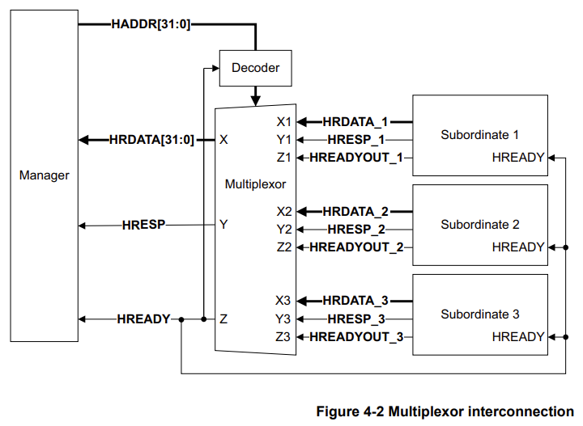
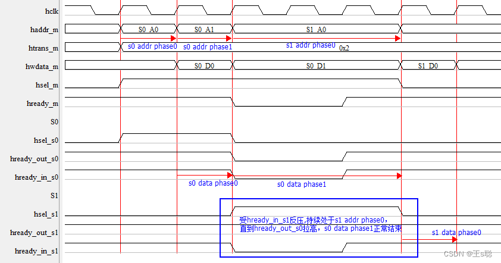
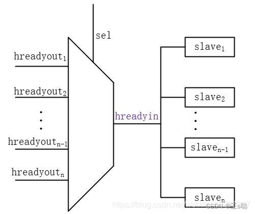

## AHB协议中Hready_in和Hready_out深入理解
### Hread_out和Hready_in信号
- **Hready_out**
是slave的一个输出信号，用来判断slave是否准备好接受master传输过来的数据，高电平有效，为低时表示slave未准备好，从而会延长data phase。

- **Hready_in**
是slave的一个输入信号，用来判断master的上一笔传输是否完成（这是pipeline特性造成的），同样也是高电平有效，为低的时候表明上一笔传输还没有完成，slave还不能对地址和控制信号采样，需要继续等待，从而会延长address phase。

- 所有的hready_out**相与输入到hready_in中**，这就意味着，**只要有一个hready_out为低，那么所有的slave都要延迟传输，直到所有的hready_out为高为止**。

- 即便是流水操作，如果AHB连续对同一个slave进行burst读写，hready_in的作用也体现不出来，***只有下边的情况才能体现hready_in的作用***：
  - 1.AHB流水操作
  - 2.AHB连续访问，且跨多个（2个或2个以上）slave访问
  - 3.slave存在反压

如下图：

AHB master第二次访问S0时，S0出现反压，但此时访问S1的addr phase已经出现，且此时S1处于ready状态（hready_out_s1=1），但由于此时访问S0的data_phase未结束，S0通过hready_out_s0反压hready_in_s1，因此即便S1处于ready状态也必须hold住。

因此在设计AHB slave时，**必须hready_out和hready_in同时为高，当次访问才能完成**。

### hready的接法
#### 1.单ahb slave系统
- 因为整个系统只有1个ahb slave，所以此时hready_in并无实际意义，直接将slave的hready_in接到slave的hready_out即可，当然master的hready_in也必须要接slave的hready_out

#### 2.多ahb slave系统
- 必须通过decoder将每个slave的hready_out译码后，输出hready_in接到所有的slave hready_in和总线桥的hready_in。

### Hsel信号
- **为什么只需在addr phase拉高，data phase却不需要保持？**
为了使用流水操作。（个人理解：如果data phase也保持为高，则在切换slave时，会出现前一个slave的hsel信号和后一个slave的hsel信号同时为高的情况。因此只在addr phase拉高就行。）

- **但data phase时hsel不保持，master和decoder侧如何确认是哪个slave返回的数据？**
实际上master就是靠AHB的2个phase操作来进行确认的，因此AHB读写不允许乱序。

- 对于decoder，则在逻辑设计上需要注意：decoder内部使用的hsel需要用hready_in锁存，也即在当次data phase未完成的情况下，因为hready为低，不会引用当前的hsel，而是继续保持此前的hsel，如此便可确保选出正确值