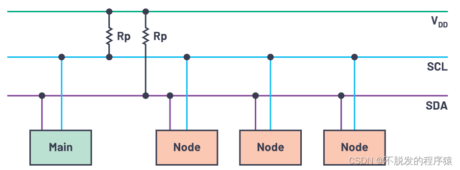
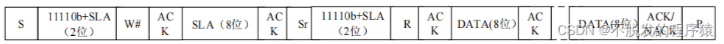
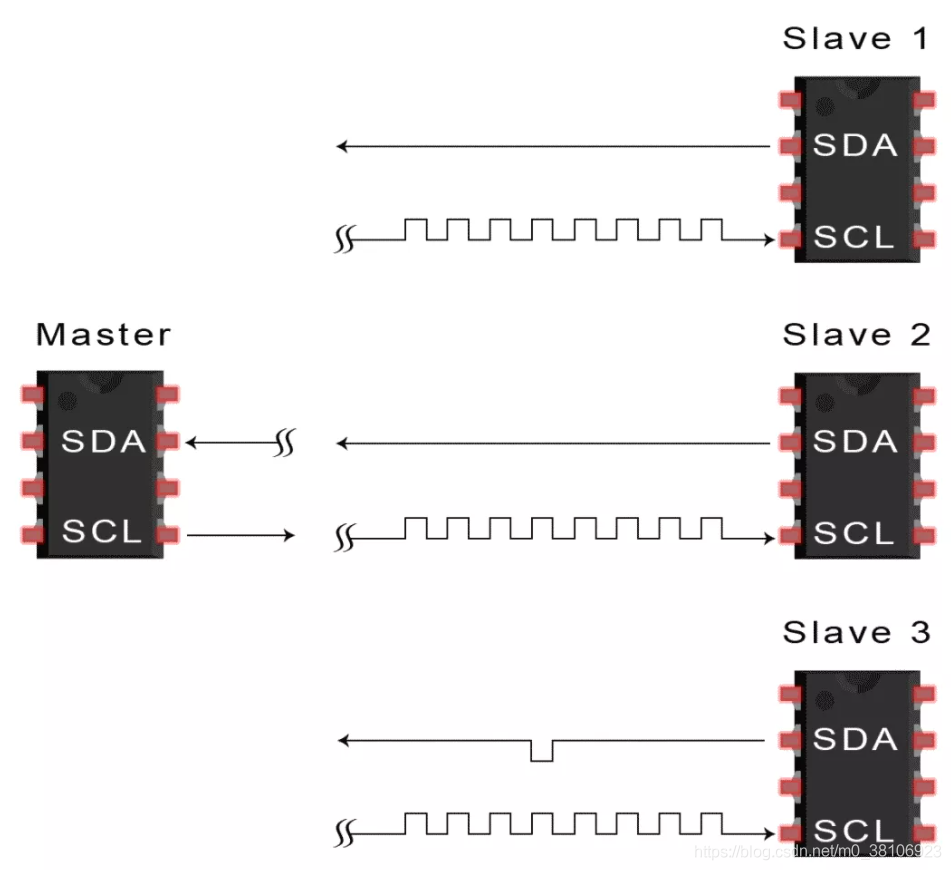

# 1、简介
- 一种简单、**双线双向的同步串行总线**，利用一根时钟线和一根数据线在连接总线的两个器件之间进行信息的传递，为设备之间数据交换提供了一种简单高效的方法。

- 每个连接到总线上的器件都有唯一的地址，任何器件既可以作为主机也可以作为从机，但同一时刻只允许有一个主机。

图 1

 

- I2C 标准是一个具有冲突检测机制和仲裁机制的真正意义上的多主机总线，它能在多个主机同时请求控制总线时利用仲裁机制避免数据冲突并保护数据。

- I2C总线具有以下特点：
  - 只需要SDA、SCL两条总线；
  - 没有严格的波特率要求；
  - 所有组件之间都存在简单的主/从关系，连接到总线的每个设备均可通过唯一地址进行软件寻址；
  - I2C是真正的多主设备总线，可提供仲裁和冲突检测；
  - 传输速度分为四种模式：
    - 1.标准模式（Standard Mode）：100 Kbps
    - 2.快速模式（Fast Mode）：400 Kbps
    - 3.高速模式（High speed mode）：3.4 Mbps
    - 4.超快速模式（Ultra fast mode）：5 Mbps
  - 最大主设备数：无限制；
  - 最大从机数：理论上，1008个从节点，寻址模式的最大节点数为2的7次方或2的10次方，但有16个地址保留用于特殊用途。

- I2C有16个保留I2C地址。这些地址对应于以下两种模式之一：0000 XXX或1111 XXX。下表显示了为特殊目的而保留的I2C地址。

| I2C 节点地址   | R/W |  位功能描述 |
| :-----: | :--: | :-------: |
| 0000 000 |  0  | 广播地址 |
| 0000 000 |  1  | 起始字节 |
| 0000 001 |  X  | CBUS 地址 |
| 0000 010 |  X  | 保留用于不同总线格式 |
| 0000 011 |  X  | 保留供未来使用 |
| 0000 1XX |  X  | 高速模式主代码 |
| 1111 1XX |  X  | 保留供未来使用 |
| 1111 0XX |  X  | 10位节点地址 |

- I2C还有两个变体，分别专注于系统和电源应用，称为系统管理总线（SMBus）和电源管理总线（PMBus）。

# 2、物理特性
- I2C 总线使用连接设备的 "SDA"（ 串行数据总线）和"SCL"（ 串行时钟总线 ） 来传送信息。

图 2

 

- I2C 总线内部使用**漏极开路输出驱动器**，因此 **SDA和 SCL 可以被拉低为低电平，但是不能被驱动为高电平**，所以每条线上都要使用一个**上拉电阻，默认情况下将其保持在高电平**。

- 根据TI 官方手册，在选择上拉电阻时需要满足下列两个条件：
  - 灌电流最大值为3 mA；

图 3

 
  
  根据上述公式，对于5 V的电源，每个上拉电阻必须至少具有1.53 kΩ，而对于3.3 V的电源，每个电阻必须至少具有967 Ω。上拉电阻典型值为4.7 kΩ。

# 3、通讯特性
- 通常情况下，一个完整的I2C通信过程包括以下 4 部分：
  - 开始条件
  - 地址传送
  - 数据传送
  - 停止条件

- 主机在 SCL 线上输出串行时钟信号，数据在 SDA 线上进行传输，每传输一个字节（最高位 MSB 开始传输）后面跟随一个应答位，一个 SCL 时钟脉冲传输一个数据位。

图 4

 

## 3.1 开始、停止条件
- 当总线上的主机都不驱动总线，总线进入空闲状态， SCL 和 SDA 都为高电平。总线空闲状态下总线上设备都可以通过发送开始条件启动通信。

- 当 SCL 线为高时，SDA 线上出现由高到低的信号，表明总线上产生了起始信号。 当SCL线为高时，SDA 线上出现由低到高的信号，表明总线上产生了停止信号，如下图所示：

图 5

 

- 当两个起始信号之间没有停止信号时，即产生了重复起始信号。主机采用这种方法与另一个从机或相同的从机以不同传输方向进行通信（例如：从写入设备到从设备读出）而不释放总线。如下图所示：

图 6

 

## 3.2 地址传送
- 开始条件或者重新开始条件后面的帧是地址帧（一个字节），用于指定主机通信的对象地址，在发送停止条件之前，指定的从机一直有效。

- I2C通讯支持：7 位寻址和10 位寻址两种模式。
  - 7 位寻址模式：
    - 地址帧（8bit）的高7 位为从机地址，地址帧第 8 位来决定数据帧传送的方向：7 位从机地址 + 1位 读/写位，读/写位控制从机的数据传输方向（0：写； 1：读） 。帧格式如下所示：

图 7

 

  - 10 位寻址模式：
    - 主机发送帧，第一帧发送头序列（11110XX0，其中 XX 表示 10 位地址的高 两位），然后第二帧发送低八位从机地址。

图 8

 
    - 主机接收帧，第一帧发送头序列（11110XX0，其中 XX 表示 10 位地址的高两位），然后第二帧发送低八位从机地址。接下来会发送一个重新开始条件，然后再发送一帧头序列（11110XX1 ，其中 XX 表示 10 位地址的高两位）**【个人理解：此处只是针对下面图片的解读，并非每次都必须重新开始】**

图 9

 
      - S ：表示开始条件；
      - SLA ：表示从机地址；
      - R/W#：表示发送和接收的方向。当 R/W# 为“1” 时，将数据从从机发送到主机；当 R/   W#为“0” 时，将数据从主机发送到从机；
      - Sr ：表示重新开始条件；
      - DATA ：表示发送和接收的数据；
      - P ：表示停止条件。】

## 3.3 数据传送
- 地址匹配一致后，总线上的主机根据 R/W 定义的方向一帧一帧的传送数据。 所有的地址帧后传送的数据都视为数据帧。即使是 10 位地址格式的低 8 位地址也视为数据帧。

- 数据帧的长度是 8 位。SCL 的低电平SDA 变化， SCL 的高电平 SDA 保持，每个时钟周期发送一位数据。数据帧后的第 9 个时钟是应答位，是接收方向发送方传送的握手信号。

图 10

 

- 如果总线上从机接收数据，在第 9 个时钟周期不响应主机，从机必须发送 NACK。如果总线上主机接收数据，第 9 个周期发送 NACK，从机接收到 NACK，从机停止发送数据。

- 无论主机还是从机发送了 NACK，数据传送终止。主机可以做下列任一动作：
  - 发送停止条件释放总线 ；
  - 发送重新开始条件开始一个新的通信。

## 3.4 总线应答
- 每传输一个字节，后面跟随一个应答位。通过将 SDA 线拉低，来允许接收端回应发送端。ACK 为 一个低电平信号，当时钟信号为高时， SDA 保持低电平则表明接收端已成功接收到发送端的数据。

- 当主机作为发送器件时，如果从机上产生无响应信号（NACK） ，主机可以产生停止信号来退出数据传输，或者产生重复起始信号开始新一轮的数据传输。

- 当主机作为接收器件时，发生无响应信号（NACK） ，从机释放 SDA 线，使主机产生停止信号或重复起始信号。

图 11

 

## 3.5 总线仲裁
I2C 总线上的仲裁分为两个部分： SCL 线上的同步和 SDA 线上的仲裁。（**SDA仲裁和SCL时钟同步处理过程没有先后关系，而是同时进行的。**）
- SCL 线上的同步（时钟同步，得益于**线与逻辑**）

图 12

 
  - 由于 I2C 总线**具有线“与”的逻辑功能**， **SCL 线上只要有一个节点发送低电平，总线上就表现低电平。当所有的节点都发送高电平时，总线才能表现为高电平**。所以，时钟低电平的时间由时钟电平期最长的器件决定，而时钟的高电平时间由时钟高电平期最短的器件决定。
  - 由于 I2C 这种特性，当多个主机同时发送时钟信号时，在总线上表示的是统一的时钟信号。**如果从机希望主机降低传送速度可以通过将 SCL 主动拉低延长其低电平时间来通知主机**，当主机在准备下一次传送时发现 SCL 的电平被拉低时进行等待，直到从机完成操作并释放 SCL 线的控制权。

- SDA 线上的仲裁(也因为**线与逻辑**)

图 13

 
  - 节点在发送1位数据后，比较总线上所呈现的数据与自己发送的是否一致。是，继续发送；否则，退出竞争。SDA线的仲裁可以保证I2C总线系统在多个主节点同时企图控制总线时通信正常进行并且数据不丢失。总线系统通过仲裁只允许一个主节点可以继续占据总线。

  - 丢失仲裁的主机立即切换到未被寻址的从机状态，以确保自身能被仲裁胜利的主机寻址到。 丢失仲裁的主机会转为接收模式，但仍产生时钟脉冲，直至发送完当前字节，将不为下个字节的传输产生时钟脉冲。

# 4、通信时序和协议

图 14

 

| 符号      | 参数 |  单位 |
| :-----:  | :--: | :-------: |
| fSCL     | SCL 时钟频率   | kHz |
| tHD(STA) | （重复）起始条件的保持时间   | µs |
| tLOW     | 引脚的低电平周期   | µs |
| tHIGH    | 引脚的高电平周期   | µs |
| tSU(STA) | 重复起始条件的建立时间   | µs |
| tHD(DAT) | 数据保持时间   | µs |
| tSU(DAT) | 数据建立时间   | ns |
| tr       | SDA 信号的上升时间   | ns |
| tf       | SDA 信号的下降时间   | ns |
| tSU(STO) | 停止条件的建立时间   | µs |

## 4.1 起始条件
起始条件总是在传输开始时出现，并由主器件发起。这样做是为了唤醒总线上的空闲节点器件。SDA线从高电平切换到低电平，然后SCL线从高电平切换到低电平。时序和协议如下图所示：

图 15

 

## 4.2 重复起始条件
在不发出停止条件的情况下，起始条件可以在传输期间重复。这是一种特殊情况，称为重复起始，用于改变数据读、写传输方向、重复尝试传输、同步多个IC，甚至控制串行存储器等。

图 16

 

## 4.3 地址帧
地址帧包含7位或10位序列

图 17

 
主器件将其想要与之通信的节点地址发送到其所连接的每个节点。然后，每个节点将主器件所发送的地址与其自己的地址进行比较。如果地址匹配，它便向主器件发送一个低电压ACK位。如果地址不匹配，则节点什么也不做，SDA线保持高电平。

## 4.4 读/写位
**0写1读**

图 18

 

## 4.5 ACK/NACK位
消息中的每一帧后面都跟随一个应答⁄不应答位。如果成功接收到一个地址帧或数据帧，则从机会向主机返回一个ACK位。

图 19

 

## 4.6 数据帧
主器件检测到来自从节点的ACK位之后，就准备发送第一数据帧。数据帧总是8位长，并以MSB优先方式发送。每个数据帧之后紧接着一个ACK⁄NACK位，以验证该帧是否已成功接收。主器件或节点（取决于谁发送数据）必须收到ACK位，然后才能发送下一数据帧。

图 20

 

## 4.7 停止条件
发送完所有数据帧之后，主器件可以向节点发送停止条件以停止传输。停止条件是指SCL线上的电压从低电平变为高电平，然后在SCL线保持高电平的情况下，SDA线上的电压从低电平变为高电平。

图 21

 

# 5、工作过程
- 第一步：起始条件
主设备通过将SDA线从高电平切换到低电平，再将SCL线从高电平切换到低电平，来向每个连接的从机发送启动条件。

图 22

 

- 第二步：发送从设备地址
主设备向每个从机发送要与之通信的从机的7位或10位地址，以及相应的读/写位。

图 23

 

- 第三步：接收应答
每个从设备将主设备发送的地址与其自己的地址进行比较。如果地址匹配，则从设备通过**将SDA线拉低一位以表示返回一个ACK位**。

如果来自主设备的地址与从机自身的地址不匹配，则**从设备将SDA线拉高，表示返回一个NACK位**。

图 24

 

- 第四步：收发数据
主设备发送或接收数据到从设备

图 25

 

- 第五步：接收应答
在传输完每个数据帧后，接收设备将另一个ACK位返回给发送方，以确认已成功接收到该帧。

图 26

 

- 第六步：停止通信
为了停止数据传输，主设备将SCL切换为高电平，然后再将SDA切换为高电平，从而向从机发送停止条件。

图 27

 

# 6、多主多从情形
当两个主设备试图通过SDA线路同时发送或接收数据时，，**每个主设备都需要在发送消息之前检测SDA线是低电平还是高电平**：
  - 如果SDA线为低电平，则意味着另一个主设备可以控制总线，并且主设备应等待发送消息；
  - 如果SDA线为高电平，则可以安全地发送消息。

图 28

 