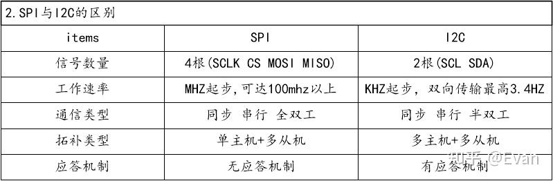

## 一、简介
- SPI，Serial Peripheral Interface，是一种高速、全双工、同步通信总线，所以可以在同一时间发送和接收数据，SPI没有定义速度限制，通常能达到甚至超过10 M/bps。

- SPI有主、从两种模式，通常由一个主模块和一个或多个从模块组成（**SPI不支持多主机**），主模块选择一个从模块进行同步通信，从而完成数据的交换。提供时钟的为主设备（Master），接收时钟的设备为从设备（Slave），SPI接口的读写操作，都是由主设备发起，当存在多个从设备时，通过各自的片选信号进行管理。

- SPI接口一般使用4根信号线：
  - **CS/SS**：从设备片选信号，由主设备控制。它的功能是用来作为“片选引脚”，也就是选择指定的从设备，让主设备可以单独地与特定从设备通讯，避免数据线上的冲突。
  - **SCLK**：串行时钟信号，由主设备产生。
  - **MOSI**：主设备输出/从设备输入引脚。该引脚在主模式下发送数据，在从模式下接收数据。
  - **MISO**：主设备输入/从设备输出引脚。该引脚在从模式下发送数据，在主模式下接收数据。

图 1

 

## 二、通信原理
SPI主设备和从设备都有一个串行移位寄存器，主设备通过向它的SPI串行寄存器写入一个字节来发起一次传输。

图 2

 

- SPI数据通信的流程：
  - 1.主设备发起信号，将CS/SS拉低，启动通信。
  - 2.主设备通过发送时钟信号，来告诉从设备进行写数据或者读数据操作，从设备会立即读取数据线上的信号，这样就得到了一位数据（1bit）。
  - 3.主设备（Master）将要发送的数据写到发送数据缓存区（Menory），缓存区经过移位寄存器（缓存长度不一定，看具体配置），串行移位寄存器通过MOSI信号线将字节一位一位的移出去传送给从从设备，同时MISO接口接收到的数据经过移位寄存器一位一位的移到接收缓存区。
  - 4.从设备（Slave）也将自己的串行移位寄存器（缓存长度不一定，看具体配置）中的内容通过MISO信号线返回给主机。同时通过MOSI信号线接收主机发送的数据，这样，两个移位寄存器中的内容就被交换。

图 3

 

> 注意，SPI是“全双工”（具有单独的发送和接收线路），因此可以在同一时间发送和接收数据。

> SPI只有主模式和从模式之分，没有读和写的说法，外设的写操作和读操作是同步完成的。若只进行写操作，主机只需忽略接收到的字节（虚拟数据）；反之，若主机要读取从机的一个字节，就必须发送一个空字节来引发从机的传输。也就是说，**你发一个数据必然会收到一个数据；你要收一个数据必须也要先发一个数据**。

## 三、通信特性
### 3.1 设备选择
SPI为**单主设备（Single Master）**通信协议，拉低从设备对应的SS线（SS是低电平有效）进行设备选择。

### 3.2 时钟
#### 3.2.1 时钟频率
从理论上讲，只要实际可行，时钟速率就可以是任何速率，当然这个速率受限于每个系统能提供多大的系统时钟频率，以及最大的SPI传输速率。

#### 3.2.2 时钟极性（CKP或CPOL）
- CKP = 0：时钟空闲IDLE为低电平 0；
- CKP = 1：时钟空闲IDLE为高电平 1。

#### 3.2.3 时钟相位（CKE或CPHA）
- CKE = 0：在时钟信号SCK的第一个跳变沿采样；
- CKE = 1：在时钟信号SCK的第二个跳变沿采样。

### 3.3 四种模式
由时钟极性和时钟相位组合成了4中工作模式，具体情况见下图

图 4

 

> 如果数据采样是在上升沿，数据发送则是在下降沿；反之，同理。

举例：
工作模式00：

图 5

 

工作模式11：

图 6

 

## 四、多从机模式
两种连接方式：多片选、菊花链。

- 多片选：
 

图 7

 
缺点：；如果同时将两个SS信号线拉低，则可能会出现乱码，因为从机可能都试图在同一条MISO线上传输数据，最终导致接收数据乱码。

- 菊花链：

图 8

 
缺点：信号串行传输，一旦数据链路中的某设备发生故障的时候，它下面优先级较低的设备就不可能得到服务了。另一方面，距离主机越远的从机，获得服务的优先级越低，所以需要安排好从机的优先级，并且设置总线检测器，如果某个从机超时，则对该从机进行短路，防止单个从机损坏造成整个链路崩溃的情况。

## 五、SPI优缺点分析
### 5.1 优点
- 无起始位和停止位，因此数据位可以连续传输而不会被中断；
- 没有像I2C这样复杂的从设备寻址系统；
- 数据传输速率比I2C更高（几乎快两倍）；
- 分离的MISO和MOSI信号线，因此可以同时发送和接收数据；
- 极其灵活的数据传输，不限于8位，它可以是任意大小的字；
- 非常简单的硬件结构。从站不需要唯一地址（与I2C不同）。从机使用主机时钟，不需要精密时钟振荡器/晶振（与UART不同）。不需要收发器（与CAN不同）。

### 5.2 缺点
- 使用四根信号线（I2C和UART使用两根信号线）；
- 无法确认是否已成功接收数据（I2C拥有此功能）；
- 没有任何形式的错误检查，如UART中的奇偶校验位；
- 只允许一个主设备；
- 没有硬件从机应答信号（主机可能在不知情的情况下无处发送）；
- 没有定义硬件级别的错误检查协议；
- 与RS-232和CAN总线相比，只能支持非常短的距离；

## 附录补充
### SPI和I2C总线的对比

图 9

 