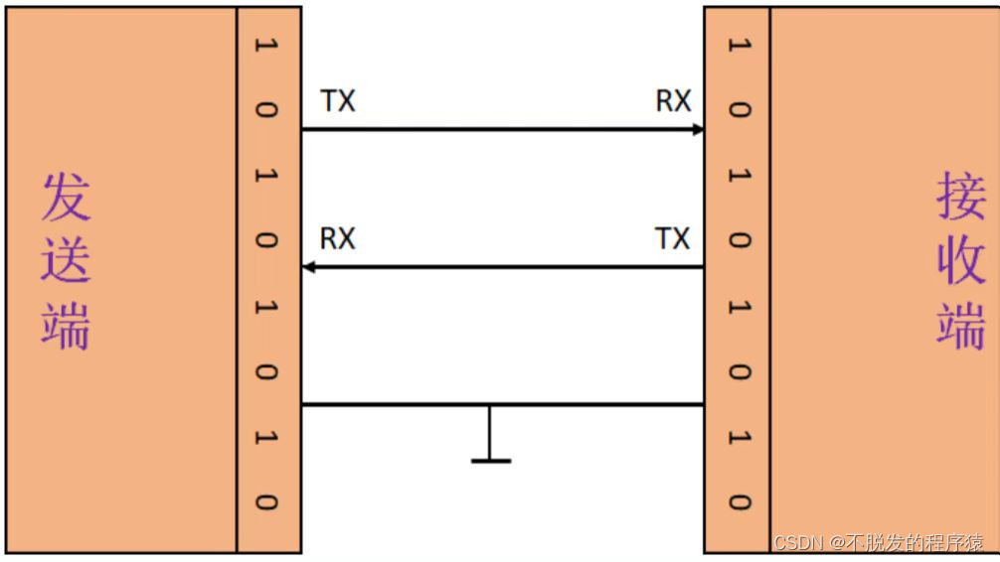
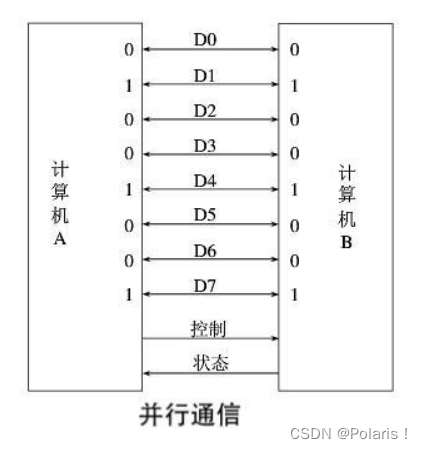
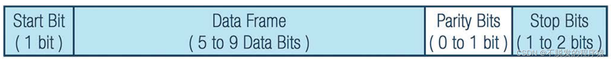
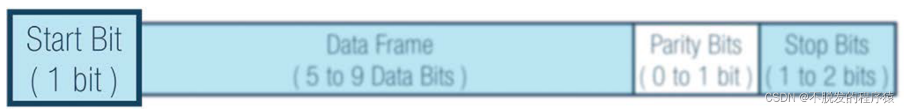
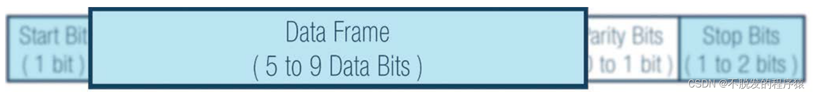
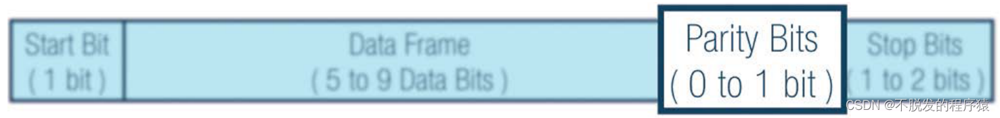
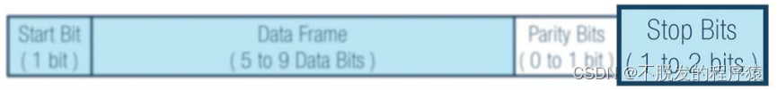

## 一、简介
- UART，通用异步收发传输器（Universal Asynchronous Receiver/Transmitter），是一种双向、串行、异步的通信总线，仅用一根数据接收线和一根数据发送线就能实现全双工通信。最大主机数为1，zuid

- 典型的串口通信使用3根线完成，分别是：发送线（TX）、接收线（RX）和地线（GND），通信时必须将双方的TX和RX交叉连接并且GND相连才可正常通信，如下图所示：

图 1

 

## 二、通信方式分类
通信方式是指通信双方之间的工作方式或信号传输方式。根据数据传输方式，可分为：

### 2.1 串行通信
- 指利用一条传输线将数据一位位地顺序传送，也可以用两个信号线组成全双工通信，如rs232。特点是通信线路简单，利用简单的线缆就可实现通信，降低成本，适用于远距离通信，但传输速度慢的应用场合。

根据通信数据的同步方式，可分为：同步和异步。
#### 2.1.1 同步通信
- 在同步通讯中，收发设备双方会使用一根信号线表示时钟信号，在时钟信号的驱动下双方进行协调，同步数据。通讯中通常双方会统一规定在时钟信号的上升沿或下降沿对数据线进行采样。

#### 2.1.2 异步通信
- 在异步通讯中，不使用时钟信号进行数据同步，它们直接在数据信号中穿插一些同步用的信号位，或者把主体数据进行打包，以数据帧的格式传输数据。例如规定由起始位、数据位、奇偶校验位、停止位等。

- 某些通讯中还需要双方约定数据的传输速率，以便更好地同步 。波特率(bps)是衡量数据传送速率的指标。

串行通信又称为点对点通信，对于点对点之间的通信，根据数据的传输方向与时间关系，又可分为单工通信、半双工通信及全双工通信三种方式。
#### 2.1.3 单工方式
只允许数据按照一个固定的方向传送，在任何时刻都只能进行一个方向的通信，一个设备固定为发送设备，一个设备固定为接收设备。

#### 2.1.4 半双工方式
两个设备之间可以收发数据，但是不能在同一时刻进行，每次只能有一个设备发送，另一个站接收。

#### 2.1.5 全双工方式
在同一时刻，两个设备之间可以同时进行发送和接收数据。

### 2.2 并行通信
利用多条传输线将一个数据的各位同时传送。

图 2

 

## 三、UART协议介绍
在 UART中，传输模式为数据包形式。数据包由起始位、数据帧、奇偶校验位和停止位组成。

图 3

 

### 3.1 起始位
当不传输数据时， UART 数据传输线通常保持高电压电平。若要开始数据传输，发送UART 会将传输线从高电平拉到低电平并保持1 个时钟周期。

当接收 UART 检测到高到低电压跃迁时，便开始以波特率对应的频率读取数据帧中的位。

图 4

 

### 3.2 数据位
数据帧包含所传输的实际数据。如果使用奇偶校验位，数据帧长度可以是5 位到 8 位。如果不使用奇偶校验位，数据帧长度可以是9 位。

在大多数情况下，数据以最低有效位优先方式发送。

图 5

 

### 3.3 奇偶校验位
当奇偶校验位与数据匹配时，UART 认为传输未出错。但是，如果奇偶校验位为0 ，而总和为奇数，或者奇偶校验位为 1 ，而总和为偶数，则UART 认为数据帧中的位已改变。

电磁辐射、不一致的波特率或长距离数据传输都可能改变数据位。

图 6

 

### 3.4 停止位
为了表示数据包结束，发送 UART 将数据传输线从低电压驱动到高电压并保持1 到 2 位时间。

图 7

 

## 四、UART优缺点 
- 优点：
  - 通信只需要两条数据线;
  - 无需时钟信号;
  - 有奇偶校验位，方便通信的差错检查;
  - 只需要接收端和发送端设置好数据包结构，即可稳定通信;

- 缺点：
  - 传输速率较低;
  - 接口使用一根信号线和一根信号返回线而构成共地的传输形式，这种共地传输容易产生共模干扰，所以抗噪声干扰性弱;
  - 传输距离有限，数据帧最大支持9位数据;
