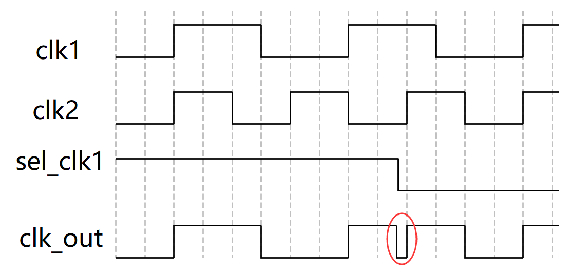
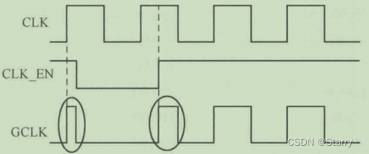
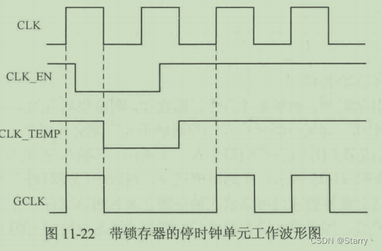
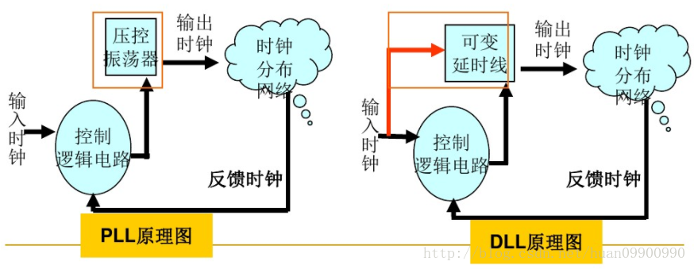
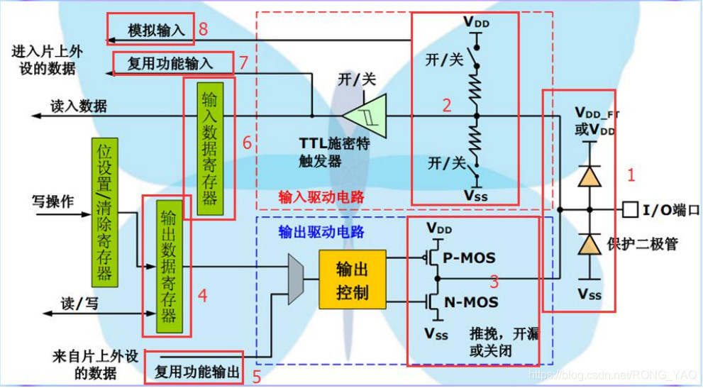

# 一、逻辑函数的化简
## 卡诺图
- verilog卡诺图的最大项(POS)和最小项(SOP)化简
  - sop：积的和，圈1化最简，每部分之间|（或）连接，最终呈现为 与或式。
  - pos：和的积，圈0化最简，每部分取反相用&连接（与），最终呈现为 或与式。

# 二、时钟
## 2.1 时钟切换
### 2.1.1 时钟切换问题
直接采用选择逻辑对时钟进行切换的电路图：

<div align="center"><p>图 0</p></div> 

假如时钟选择信号 sel_clk1 与两个时钟都是异步的，那么时钟切换时刻就是任意的。假如时钟由 clk1 切换到 clk2，且切换时刻为 clk1 输出电平为高的时候，此时立即切换时钟就会导致输出时钟出现毛刺（glitch）。波形示意图如下：

<div align="center"><p>图 1</p></div> 

### 2.1.2 时钟切换方案
> 在两个电平相反的时候切换时钟，肯定有毛刺；电平相同的时候，即使不产生毛刺，时钟切换后的第一个时钟的周期或占空比也不是理想的。所以，为避免毛刺的产生，需要在两个时钟都为低电平的时候进行时钟切换。

典型的时钟切换电路如下：

该电路利用时钟下降沿对时钟选择信号 sel_clk1 进行缓存。同时一个时钟选择信号对另一个时钟进行反馈控制，保证同一时刻只能有一路时钟有效。最后采用"或操作"将两路时钟合并，完成时钟切换的过程。

<div align="center"><p>图 2</p></div> 

采用上述电路完成时钟切换（clk1->clk2）的波形示意图如下所示。

由图可知，clk1 向 clk2 切换时，先关闭 clk1, 然后打开 clk2。由于时钟选择信号被同步到时钟下降沿，所以切换过程中不会出现毛刺。

<div align="center"><p>图 3</p></div> 

clk2 向 clk1 切换的波形示意图如下所示。

<div align="center"><p>图 4</p></div> 

考虑到选择信号有可能是异步信号，需要在时钟选择信号的缓存触发器之前加两级触发器进行同步处理，来减少亚稳态的传播，结构图如下。该时钟切换电路更具有普遍性。

<div align="center"><p>图 5</p></div> 

**其电路逻辑代码**：
```verilog
module clk_switch(
    input               rstn ,
    input               clk1,
    input               clk2,
    input               sel_clk1 , // 1 clk1, 0 clk2
    output              clk_out
    );

   reg [2:0]            sel_clk1_r ;
   reg [1:0]            sel_clk1_neg_r ;
   reg [2:0]            sel_clk2_r ;
   reg [1:0]            sel_clk2_neg_r ;

   //使用3拍缓存，同步另一个时钟控制信号与本时钟控制信号的"与"逻辑操作
   always @(posedge clk1 or negedge rstn) begin
      if (!rstn) begin
         sel_clk1_r     <= 3'b111 ; //注意默认值
      end
      else begin
         //sel clk1, and not sel clk2
         sel_clk1_r     <= {sel_clk1_r[1:0], sel_clk1 & (!sel_clk2_neg_r[1])} ;
      end
   end

   //在下降沿，使用2拍缓存时钟选择信号
   always @(negedge clk1 or negedge rstn) begin
      if (!rstn) begin
         sel_clk1_neg_r <= 2'b11 ; //注意默认值
      end
      else begin
         sel_clk1_neg_r <= {sel_clk1_neg_r[0], sel_clk1_r[2]} ;
      end
   end

   //使用3拍缓存，同步另一个时钟控制信号与本时钟控制信号的"与"逻辑操作
   always @(posedge clk2 or negedge rstn) begin
      if (!rstn) begin
         sel_clk2_r     <= 3'b0 ; //注意默认值
      end
      else begin
         //sel clk2, and not sel clk1
         sel_clk2_r     <= {sel_clk2_r[1:0], !sel_clk1 & (!sel_clk1_neg_r[1])} ;
      end
   end

   //在下降沿，使用2拍缓存时钟选择信号
   always @(negedge clk2 or negedge rstn) begin
      if (!rstn) begin
         sel_clk2_neg_r <= 2'b0 ; //注意默认值
      end
      else begin
         sel_clk2_neg_r <= {sel_clk2_neg_r[0], sel_clk2_r[2]} ;
      end
   end

   //时钟逻辑运算时，一般使用特定的工艺单元库。
   //这里用 Verilog 自带的逻辑门单元代替
   wire clk1_gate, clk2_gate ;
   and (clk1_gate, clk1, sel_clk1_neg_r[1]) ;
   and (clk2_gate, clk2, sel_clk2_neg_r[1]) ;
   or  (clk_out, clk1_gate, clk2_gate) ;

endmodule
```
## 2.2 时钟分频
### 2.2.1 偶数分频
采用触发器反向输出端连接到输入端的方式，可构成简单的 2 分频电路。
以此为基础进行级联，可构成 4 分频，8 分频电路。
电路实现如下图所示，用 Verilog 描述时只需使用简单的取反逻辑即可。

<div align="center"><p>图 6</p></div> 

如果偶数分频系数过大，就需要对分频系数 N 循环计数进行分频。在计数周期达到分频系数中间数值 N/2 时进行时钟翻转，可保证分频后时钟的占空比为 50%。因为是偶数分频，也可以对分频系数中间数值 N/2 进行循环计数。

```verilog
module even_divisor
  # (parameter DIV_CLK = 10 )
    (
    input               rstn ,
    input               clk,
    output              clk_div2,
    output              clk_div4,
    output              clk_div10
    );

   //2 分频
   reg                  clk_div2_r ;
   always @(posedge clk or negedge rstn) begin
      if (!rstn) begin
         clk_div2_r     <= 'b0 ;
      end
      else begin
         clk_div2_r     <= ~clk_div2_r ;
      end
   end
   assign       clk_div2 = clk_div2_r ;

   //4 分频
   reg                  clk_div4_r ;
   always @(posedge clk_div2 or negedge rstn) begin
      if (!rstn) begin
         clk_div4_r     <= 'b0 ;
      end
      else begin
         clk_div4_r     <= ~clk_div4_r ;
      end
   end
   assign clk_div4      = clk_div4_r ;

   //N/2 计数
   reg [3:0]            cnt ;
   always @(posedge clk or negedge rstn) begin
      if (!rstn) begin
         cnt    <= 'b0 ;
      end
      else if (cnt == (DIV_CLK/2)-1) begin
         cnt    <= 'b0 ;
      end
      else begin
         cnt    <= cnt + 1'b1 ;
      end
   end

   //输出时钟
   reg                  clk_div10_r ;
   always @(posedge clk or negedge rstn) begin
      if (!rstn) begin
         clk_div10_r <= 1'b0 ;
      end
      else if (cnt == (DIV_CLK/2)-1 ) begin
         clk_div10_r <= ~clk_div10_r ;
      end
   end
   assign clk_div10 = clk_div10_r ;
endmodule
```

仿真结果：

<div align="center"><p>图 7</p></div> 

### 2.2.2 奇数分频
奇数分频如果不要求占空比为 50%，可按照偶数分频的方法进行分频。即计数器对分频系数 N 进行循环计算，然后根据计数值选择一定的占空比输出分频时钟。

如果奇数分频输出时钟的高低电平只差一个 cycle ，则可以利用源时钟双边沿特性并采用"与操作"或"或操作"的方式将分频时钟占空比调整到 50%。

**或操作调整占空比**
采用"或操作"产生占空比为 50% 的 3 分频时序图如下所示。

利用源时钟上升沿分频出高电平为 1 个 cycle、低电平为 2 个 cycle 的 3 分频时钟。

利用源时钟下降沿分频出高电平为 1 个 cycle、低电平为 2 个 cycle 的 3 分拼时钟。

两个 3 分频时钟应该在计数器相同数值、不同边沿下产生，相位差为半个时钟周期。然后将 2 个时钟进行"或操作"，便可以得到占空比为 50% 的 3 分频时钟。


<div align="center"><p>图 8</p></div> 

同理，9 分频时，则需要在上升沿和下降沿分别产生 4 个高电平、5 个低电平的 9 分频时钟，然后再对两个时钟做"或操作"即可。Verilog 描述如下：

```verilog
module odo_div_or
  #(parameter DIV_CLK = 9)
   (
    input               rstn ,
    input               clk,
    output              clk_div9
    );

   //计数器
   reg [3:0]            cnt ;
   always @(posedge clk or negedge rstn) begin
      if (!rstn) begin
         cnt    <= 'b0 ;
      end
      else if (cnt == DIV_CLK-1) begin
         cnt    <= 'b0 ;
      end
      else begin
         cnt    <= cnt + 1'b1 ;
      end
   end

   //在上升沿产生9分频
   reg                  clkp_div9_r ;
   always @(posedge clk or negedge rstn) begin
      if (!rstn) begin
         clkp_div9_r <= 1'b0 ;
      end
      else if (cnt == (DIV_CLK>>1)-1 ) begin //计数4-8位低电平
        clkp_div9_r <= 0 ;
      end
      else if (cnt == DIV_CLK-1) begin //计数 0-3 为高电平
        clkp_div9_r <= 1 ;
      end
   end
  
   //在下降沿产生9分频
   reg                  clkn_div9_r ;
   always @(negedge clk or negedge rstn) begin
      if (!rstn) begin
         clkn_div9_r <= 1'b0 ;
      end
      else if (cnt == (DIV_CLK>>1)-1 ) begin 
        clkn_div9_r <= 0 ;
      end
      else if (cnt == DIV_CLK-1) begin 
        clkn_div9_r <= 1 ;
      end
   end

   //或操作，往往使用基本逻辑单元库
   // or (clk_div9, clkp_div9_r, clkn_div9_r) ;
   assign clk_div9 = clkp_div9_r | clkn_div9_r ;

endmodule
```
仿真结果：
<div align="center"><p>图 9</p></div> 

**与操作调整占空比**
采用"与操作"产生占空比为 50% 的 3 分频时序图如下所示。

利用源时钟上升沿分频出高电平为 2 个 cycle、低电平为 1 个 cycle 的 3 分频时钟。

利用源时钟下降沿分频出高电平为 2 个 cycle、低电平为 1 个 cycle 的 3 分拼时钟。

两个 3 分频时钟应该在计数器相同数值、不同边沿下产生，相位差为半个时钟周期。然后将 2 个时钟进行"与操作"，便可以得到占空比为 50% 的 3 分频时钟。

<div align="center"><p>图 10</p></div> 

同理，9 分频时，则需要在上升沿和下降沿分别产生 5 个高电平、4 个低电平的 9 分频时钟，然后再对两个时钟做"与操作"即可。Verilog 描述如下。

```verilog
module odo_div_and
   #( parameter DIV_CLK = 9 )
   (
    input               rstn ,
    input               clk,
    output              clk_div9
    );

   //计数器
   reg [3:0]            cnt ;
   always @(posedge clk or negedge rstn) begin
      if (!rstn) begin
         cnt    <= 'b0 ;
      end
      else if (cnt == DIV_CLK-1) begin
         cnt    <= 'b0 ;
      end
      else begin
         cnt    <= cnt + 1'b1 ;
      end
   end

   //在上升沿产生9分频
   reg                  clkp_div9_r ;
   always @(posedge clk or negedge rstn) begin
      if (!rstn) begin
         clkp_div9_r <= 1'b0 ;
      end
      else if (cnt == (DIV_CLK>>1) ) begin //计数5-8位低电平
        clkp_div9_r <= 0 ;
      end
      else if (cnt == DIV_CLK-1) begin //计数 0-4 为高电平
        clkp_div9_r <= 1 ;
      end
   end

   //在下降沿产生9分频
   reg                  clkn_div9_r ;
   always @(negedge clk or negedge rstn) begin
      if (!rstn) begin
         clkn_div9_r <= 1'b0 ;
      end
      else if (cnt == (DIV_CLK>>1) ) begin 
        clkn_div9_r <= 0 ;
      end
      else if (cnt == DIV_CLK-1) begin 
        clkn_div9_r <= 1 ;
      end
   end

   //与操作，往往使用基本逻辑单元库
   //and (clk_div9, clkp_div9_r, clkn_div9_r) ;
   assign clk_div9 = clkp_div9_r & clkn_div9_r ;

endmodule
```
仿真结果：
<div align="center"><p>图 11</p></div> 

### 2.2.3 半整数分频
利用时钟的双边沿逻辑，可以对时钟进行半整数的分频。但是无论怎么调整，**半整数分频的占空比不可能是 50%**。

这里只介绍一种和奇数分频调整占空比类似的方法。

(1) 例如进行 3.5 倍分频时，计数器循环计数到 7，分别产生由 4 个和 3 个源时钟周期组成的 2 个分频时钟。从 7 个源时钟产生了 2 个分频时钟的角度来看，该过程完成了 3.5 倍的分频，但是每个分频时钟并不是严格的 3.5 倍分频。
(2) 下面对周期不均匀的分频时钟进行调整。一次循环计数中，在源时钟下降沿分别产生由 4 个和 3 个源时钟周期组成的 2 个分频时钟。相对于第一次产生的 2 个周期不均匀的时钟，本次产生的 2 个时钟相位一个延迟半个源时钟周期，一个提前半个源时钟周期。
(3) 将两次产生的时钟进行"或操作"，便可以得到周期均匀的 3.5 倍分频时钟。分频波形示意图如下所示。

<div align="center"><p>图 12</p></div> 

```verilog
module half_divisor(
    input               rstn ,
    input               clk,
    output              clk_div3p5
    );

   //计数器
   parameter            MUL2_DIV_CLK = 7 ;
   reg [3:0]            cnt ;
   always @(posedge clk or negedge rstn) begin
      if (!rstn) begin
         cnt    <= 'b0 ;
      end
      else if (cnt == MUL2_DIV_CLK-1) begin //计数2倍分频比
         cnt    <= 'b0 ;
      end
      else begin
         cnt    <= cnt + 1'b1 ;
      end
   end

   reg                  clk_ave_r ;
   always @(posedge clk or negedge rstn) begin
      if (!rstn) begin
         clk_ave_r <= 1'b0 ;
      end
      //first cycle: 4 source clk cycle
      else if (cnt == 0) begin
         clk_ave_r <= 1 ;
      end
      //2nd cycle: 3 source clk cycle
      else if (cnt == (MUL2_DIV_CLK/2)+1) begin
         clk_ave_r <= 1 ;
      end
      else begin
         clk_ave_r <= 0 ;
      end
   end

   //adjust
   reg                  clk_adjust_r ;
   always @(negedge clk or negedge rstn) begin
      if (!rstn) begin
         clk_adjust_r <= 1'b0 ;
      end
      //本次时钟只为调整一致的占空比
      else if (cnt == 1) begin
         clk_adjust_r <= 1 ;
      end
      //本次时钟只为调整一致的精确分频比
      else if (cnt == (MUL2_DIV_CLK/2)+1 ) begin
         clk_adjust_r <= 1 ;
      end
      else begin
         clk_adjust_r <= 0 ;
      end
   end

   assign clk_div3p5 = clk_adjust_r | clk_ave_r ;

endmodule
```

仿真结果：
<div align="center"><p>图 13</p></div> 

### 2.2.4 小数分频
不规整的小数分频**不能做到分频后的每个时钟周期都是源时钟周期的小数分频倍，更不能做到分频后的时钟占空比均为 50%**，因为 Verilog 不能对时钟进行小数计数。和半整数分频中第一次分频时引入的"平均频率"概念类似，小数分频也是基于可变分频和多次平均的方法实现的。

例如进行 7.6 倍分频，则保证源时钟 76 个周期的时间等于分频时钟 10 个周期的时间即可。此时需要在 76 个源时钟周期内进行 6 次 8 分频，4 次 7 分频。再例如进行 5.76 分频，需要在 576 个源时钟周期内进行 76 次 6 分频，24 次 5 分频。

下面阐述下这些分频参数的计算过程：
当进行 7 分频时，可以理解为 70 个源时钟周期内进行 10 次 7 分频。在 76 个源时钟周期内仍然进行 10 次分频，相当于将多余的 6 个源时钟周期增加、分配到 70 个源时钟周期内，即完成了 7.6 倍分频操作。分频过程中必然有 6 个分频时钟是 8 分频得到的，剩下的 4 个分频时钟则仍然会保持原有的 7 分频状态。

其计算公式为：
```markdown
7N + 8M = 76
N  + M   = 10 
```

其电路逻辑代码：
```verilog
module frac_divisor
  #(
   parameter            SOURCE_NUM = 76 , //cycles in source clock
   parameter            DEST_NUM   = 10  //cycles in destination clock
   )
   (
    input               rstn ,
    input               clk,
    output              clk_frac
    );
  
   //7分频参数、8分频参数、次数差值
   parameter    SOURCE_DIV = SOURCE_NUM/DEST_NUM ; 
   parameter    DEST_DIV   = SOURCE_DIV + 1; 
   parameter    DIFF_ACC   = SOURCE_NUM - SOURCE_DIV*DEST_NUM ;


   reg [3:0]            cnt_end_r ;  //可变分频周期
   reg [3:0]            main_cnt ;   //主计数器
   reg                  clk_frac_r ; //时钟输出，高电平周期数为1
   always @(posedge clk or negedge rstn) begin
      if (!rstn) begin
         main_cnt    <= 'b0 ;
         clk_frac_r  <= 1'b0 ;
      end
      else if (main_cnt == cnt_end_r) begin
         main_cnt    <= 'b0 ;
         clk_frac_r  <= 1'b1 ;
      end
      else begin
         main_cnt    <= main_cnt + 1'b1 ;
         clk_frac_r  <= 1'b0 ;
      end
   end
   //输出时钟
   assign       clk_frac        = clk_frac_r ;
   //差值累加器使能控制
   wire         diff_cnt_en     = main_cnt == cnt_end_r ;

   //差值累加器逻辑
   reg [4:0]            diff_cnt_r ;
   wire [4:0]           diff_cnt = diff_cnt_r >= DEST_NUM ?
                                   diff_cnt_r -10 + DIFF_ACC : 
                                   diff_cnt_r + DIFF_ACC ;                                
   always @(posedge clk or negedge rstn) begin
      if (!rstn) begin
         diff_cnt_r <= 0 ;
      end
      else if (diff_cnt_en) begin
         diff_cnt_r <= diff_cnt ;
      end
   end

   //分频周期变量的控制逻辑
   always @(posedge clk or negedge rstn) begin
      if (!rstn) begin
         cnt_end_r      <= SOURCE_DIV-1 ;
      end
      //差值累加器溢出时，修改分频周期
      else if (diff_cnt >= 10) begin
         cnt_end_r      <= DEST_DIV-1 ;
      end
      else begin
         cnt_end_r      <= SOURCE_DIV-1 ;
      end
   end

endmodule
```

仿真结果：
<div align="center"><p>图 14</p></div> 

### 2.2.5 分频小结

- 偶数分频不使用时钟双边沿逻辑即可完成占空比为 50% 的时钟分频，是最理想的分频状况。
- 奇数分频如果要产生 50% 占空比的分频时钟，则需要使用时钟的双边沿逻辑。如果不要求占空比的话，实现方法和偶数分频类似。
- 半整数分频属于特殊的小数分频，可以用**双边沿逻辑**进行设计。通过一定逻辑将两个双边沿时钟信号整合为最后的一路输出时钟时，建议不要使用选择逻辑。因为容易出现毛刺现象，电路中又会增加一定的不确定性。
- 小数分频的基本思想是，**输出时钟在一段时间内的平均频率达到分频要求即可**。但是考虑到相位抖动，还需要对分频系数变化的分频逻辑进行平均操作

# 三、低功耗设计
## 3.1 低功耗简介

<div align="center"><p>图 0</p></div> 

1. 动态功耗
动态功耗主要包括开关功耗（又称为翻转功耗）和短路功耗（又称为内部功耗）。

- 开关功耗
> 在CMOS数字电中，对负载电容进行充放电时消耗的功耗为开关功耗。

如下COMS非门：
<div align="center"><p>图 1</p></div> 

当 Vin = 0 时，上面的 PMOS 导通，下面的 NMOS 截止；VDD 对负载电容 Cload 进行充电。充电完成后，Vout 的电平为高。
当 Vin = 1 时，上面的 PMOS 截止，下面的 NMOS 导通，负载电容通过 NMOS 进行放电。放电完成后，Vout 的电平为低。这样一开一闭的变化，即电源的充放电，就形成了开关功耗。

开关功耗的计算公式如下：其中，VDD 为供电电压，Cload 为后级电路等效的负载电容，Tr 为输入信号的翻转率。
<div align="center"><p>图 2</p></div> 

- 短路功耗
> 信号的翻转不是在瞬时完成的。因此，在输入信号进行翻转时，PMOS 和 NMOS 总有一段时间是同时导通的，那么从电源 VDD 到地 VSS 之间就有了通路，形成短路电流，产生短路功耗。

如下反相器电路所示：
<div align="center"><p>图 3</p></div> 

短路功耗的计算公式如下：其中，Vdd 为供电电压，Tr 为翻转率，Q 为一次翻转过程中从电源流到地的电荷量。
<div align="center"><p>图 4</p></div> 

2. 静态功耗
> 在 CMOS 电路中，静态功耗主要是漏电流引起的功耗，往往与工艺有关。

<div align="center"><p>图 5</p></div> 

漏电流的组成主要为：PN 结反向电流 I1、源极和漏极之间的亚阈值漏电流 I2、栅极漏电流（包括栅极和漏极之间的感应漏电流 I3）、栅极和衬底之间的隧道漏电流 I4。

栅极和衬底之间的隧道漏电流 I4。

一般情况下，漏电流主要是指**栅极泄漏电流和亚阈值电流**。对于超深亚微米工艺，隧道漏电流成为主要电流之一。

1、在 PN 结两端加反向电压时，P 区空穴和 N 区电子的运动相反，没有电流通过，二极管处于截止状态，部分能量较大的空穴和电子会挣脱反向电场的束缚而形成微弱的漂移电流。
2、栅极泄漏功耗：在栅极加上信号后（即栅压），栅级到衬底之间会存在电容，因此在栅衬之间就会存在有电流，由此就会存在功耗。
3、 亚阈值电流：栅极电压低于导通阈值，仍会产生从漏极到源极的泄漏电流。此电流称为亚阈值泄漏电流。在较狭窄的晶体管中，漏极和源极距离较近的情况下会产生亚阈值泄漏电流。晶体管越窄，泄漏电流越大。要降低亚阈值电流，可以使用高阈值的器件，还可以通过衬底偏置增加阈值电压，这些也属于低功耗设计的考虑范畴。
4、隧道漏电流：属于量子力学范畴。

静态功耗的计算公式如下：
<div align="center"><p>图 6</p></div> 

3. 浪涌功耗
> 浪涌功耗是浪涌电流引起的功耗。浪涌电流是指开机或者唤醒时，器件流过的最大电流，因此浪涌电流也称为启动电流。

## 3.2 系统级低功耗设计
1. 多电压技术
> 一般来说，电压越低，功耗越低，但是性能往往会越差。综合功耗与性能的考虑，可以对不同的模块采用不同的电压设计。
> 实现方法：将设计分为独立的“电压导”或者“电压域”，根据每个区域对时序的要求使用不同的供电电压。比如，对时序要求严格的模块放在标准电压下操作（90nm工艺是1V）；对时序要求不是那么严格的路径可安排在其他低电压区域，比如0.8V。
> 需要额外考虑的问题：跨电压域路径时序受到影响，在设计时需要考虑时序余量。

多电压技术主要有3种：
  - 各电压区域有固定的电压。
<div align="center"><p>图 7</p></div> 

  - 各电压区域有固定的电压，电压的选择由软件控制。
<div align="center"><p>图 8</p></div> 

  - 自适应的方式，各区域电压可变，电压选择也是由软件控制，又称为动态电压条件。
动态技术是根据芯片所运行的应用程序对计算能力的不同需要，动态调节芯片的运行频率和电压（对同一芯片，频率越高，需要的电压也越高），从而达到降低功耗的目的。具体步骤可归纳为：首先采集系统负载相关信号，计算当前系统负载；再根据当前负载预测系统下一时间段性能需求；计算出系统工作需要的频率；最后根据新的频率计算相应的电压，调整供电电压。
<div align="center"><p>图 9</p></div> 

一般来说，供电电压越大，电路延迟越小，性能越高。例如，芯片的处理器核、存储器一般需要较高的性能，所以可以采用较高的电压方案。其他外部设计，可以采用较小的电压方案，来降低功耗。

1. 系统时钟分配
> 一般来说，频率越高，性能越好，但功耗越大。通过合理的时钟分配，也能有效的降低功耗.

一般可以通过以下几种方式降低功耗：
- 通过时钟分频，各模块采用合理的工作时钟
一般 CPU 总线需要较高的时钟来满足较高的设计需求，而 uart，spi 等外设工作频率不会很高。如果设计中一视同仁都采用较高的工作频率，显然会增加无端的功耗。将高速时钟进行一定的分频，分别赋予不同的模块。在满足工作性能的条件下看，采用较低的工作时钟频率，可以有效减少功耗。

- 加入多种低功耗工作模式
设计中加入多种低功耗时钟分配方案，人为的来选择一种工作模式，可以降低功耗。

| 模式   | 说明 |
| :----- | :--- |
| Normal |  主时钟使用较高频率的锁相环时钟，送入到设计电路中  |
| Slow |  主时钟使用较低的本地时钟  |
| Low-Power |  总线时钟关闭，只保留一些外设的工作时钟  |
| Sleep |  时钟全部关闭，全设计进入睡眠状态  |

- 自适应选择工作频率
和多电压技术的电压自适应调整类似，根据当前的工作状态来选择合适的工作频率，也可以降低功耗。例如电脑在处理一些简单的文档时，可以选择相对较低的工作频率；而电脑在处理一些视频渲染工作时，则需要相对较高的工作频率。工作频率和电压的动态调整，往往是低功耗设计中同时需要的策略。

3. 软硬件划分
系统中的功耗都是硬件单元消耗的。在设计过程中，系统的功能可以用硬件实现，也可以使用软件实现。

系统设计者根据设计规范和自身经验对系统性能进行推测（仿真建模），决定哪一部分使用硬件来实现，哪一部分使用软件来实现，从而达到性能和功耗的最佳平衡。例如一些参数的计算，软件计算完成后直接输入给硬件，是比较合理的设计。

总之，软硬件划分可以很大程度上降低功耗，这是系统设计者需要慎重考虑的。

4. ip和单元库选择
现在很多设计也依赖于 IP 的集成。选择 IP 时，在满足工作性能的条件下，也需要合理的选择功耗相对较低的 IP 。

设计中使用到的标准单元库，虽然实现的逻辑功能相同，但也会因为工艺库的不同具有不同的电压阈值。multi-vdd会带来不同电压域的cell互连通讯的问题，需要使用特殊的单元：level shifter。

**原理**：LVT（Low Voltage Threshold），阈值电压低，饱和电流小，所以此类单元库具有更高的速度和更大的泄漏电流。HVT（High Voltage Threshold）单元漏电流小，但速度较慢。SVT/RVT(Standard/Regular Voltage Threshold) 的性能介于 LVT 与 HVT 之间。

**建议**：选用标准单元库的时候，需要综合速度和功耗两个方面来考虑。例如，可以在关键路径使用 LVT 单元，在非关键路径使用 HVT 单元。**在时序紧张的路径上使用低阈值单元，在时序宽松的路径上使用高阈值单元**。

**使用方法**：不同阈值逻辑单元的选择和替换在综合、后端通过设定指令由工具比较自动地完成，不需要前端代码的特殊处理。一方面，如果最终设计目标是满足性能，可以使用低阈值单元进行第一遍综合以达到最好的性能来满足时序要求，再对其中不需要高性能的部分进行高阈值电压单元替换，以减小整体的漏电流和功耗。另一方面，如果设计的主要目标是功耗，在进行第一次综合时使用高阈值电压单元更合适，再找出关键路径并用低阈值电压单元进行替换。

<div align="center"><p>图 10</p></div> 

5. 其他
还有一些其他可以减少功耗的系统方法，如下一些举例：
- 合理选择算法，例如使用查找表的方法代替乘除运算，有时可以减少一些功耗。
- 利用握手信号完成异步设计，省去全局时钟，也可以减少功耗。
- 等等

## 3.3 编码级低功耗设计
1. 状态机编码与解码
状态机编码对信号的活动性具有重要影响，通过合理选择状态机状态的编码方式，减少状态机切换时电路的翻转，可以降低状态机的功耗。主要有以下三个原则：
- 格雷码相邻之间只有1 bit变化，相比二进制计数器翻转率得到了有效降低，状态机尽量还是用格雷码。此外，格雷码还消除了二进制计数的毛刺问题，是多bit信号跨时钟域的最优解决方案。对于频繁切换的相邻状态，尽量采用相邻编码状态机编码。
- 小型状态机可以选择独热码编码，在状态比较时只需要关注1bit。onehot码，指只有一位是1、其余位全是0的编码方式，常用于多路选择器MUX，同时在机器学习的数据特征处理中得到应用。onehot码优势在于省去了译码电路：
```verilog
always@(*) begin
	case(sel)
		2'b00:	out = a;
		2'b01:	out = a;
		2'b11:	out = a;
		2'b10:	out = a;
	endcase
end
```
综合电路为：
<div align="center"><p>图 11</p></div> 

```verilog
always@(*) begin
	case(sel)
		4'b0001:	out = a;
		4'b0010:	out = a;
		4'b0100:	out = a;
		4'b1000:	out = a;
	endcase
end
```
综合电路为：
<div align="center"><p>图 12</p></div> 

- 避免状态机中存在冗余的状态，识别等价状态。

2. 操作数隔离
如果逻辑计算是无效的、未被使用的，就别让它计算了，使用使能信号隔离掉输入。最终的输出信号呢也尽量保持，而不是非得置个0啊啥的，减少翻转，这样的时序逻辑还能够被综合出门控时钟进一步减少功耗。

如下代码，若sel == 2’b00、2’b10、2’b11时，dout <= dout，那么a * b的结果就不会被使用，就可以禁用乘法计算，毕竟乘法的功耗和面积还是蛮大的。
```verilog
assign res = a * b;
always@(posedge clk) begin
	if(sel == 2'b01)		//sel != 2'b01;时就不需要乘法的结果了		
		dout <= res;
end
```

<div align="center"><p>图 13</p></div> 

而```assign res = (sel == 2'b01)? (a*b):0;```可以成功禁用乘法吗？

这是大错特错，虽然在sel不是2’b01时，res的值为0，但是实际综合出的电路其实是在乘法器结果的一端连在一个MUX上！所以**实际综合出的电路还是会计算乘法的！！！**

那怎么将乘法隔离呢？思路是隔离输入，即让所有输入为0，即使a或b进行了翻转，乘法器内的信号也不会翻转，降低了功耗。
```verilog
wire a_en, b_en;
assign a_en = (sel == 2'b01)? a:0;
assign b_en = (sel == 2'b01)? b:0;

assign res = a_en * b_en;
always@(posedge clk) begin
	if(sel == 2'b01)			
		dout <= res;
end
```

<div align="center"><p>图 14</p></div> 

其本质就是为**输入信号增加使能 en**，对于较复杂的逻辑云可以进行输入隔离以降低功耗

3. 资源共享（复用）
如果有同一个逻辑运算在多处使用时，就直接复用就行了，不要每一处都重新计算一次。
```verilog
always @(*) begin
	case (mode) :
		3'b000:         result  = 1'b1 ;
        3'b001:         result  = 1'b0 ;
        3'b010:         result  = value1 == value2 ;
        3'b011:         result  = value1 != value2 ;
        3'b100:         result  = value1 > value2 ;
        3'b101:         result  = value1 < value2 ;
        3'b110:         result  = value1 >= value2 ;
        3'b111:         result  = value1 <= value2 ;
    endcase
end
```

上面代码需要6个比较器，但如果改为下面的代码则只需2个比较器、4个非门和2个与门。

```verilog
wire equal_con = (value1 == value2);
wire great_con = (value1 > value2);
always @(*) begin
	case (mode) :
		3'b000:         result  = 1'b1 ;
        3'b001:         result  = 1'b0 ;
        3'b010:         result  = equal_con ;
        3'b011:         result  = !equal_con ;
        3'b100:         result  = great_con ;
        3'b101:         result  = !great_con && !equal_con ;
        3'b110:         result  = great_con && equal_con ;
        3'b111:         result  = !great_con ;
    endcase
end
```

4. 自动门控时钟编码
按照一定的编码风格，综合工具可以根据RTL自动地综合出时钟门控电路，这样可以尽可能地提高门控的覆盖率。

**书写风格**：
- 在always语句中，最后一个else写成data_out<=data_out形式（或者不写else分支，时序逻辑中自带保持）。
```verilog
always @（posedge clk or negedge rst_n）
begin
     if(!rst_n)
         data_out <= 32'b0;
     else if (enable)
         data_out <= data_in;
     //else
     //  data_out <= data_out;
end
```
- 最后一个分支无法写成data_out<=data_out，并且是一个电平条件。那么可以把最后一个分支再细分为两个分支：一个分支是由这个有效电平信号形式的脉冲信号条件；另一个分支则是最后一个else保持行为。该种写法因为需要把电平信号转化为脉冲条件，所以需要增加一个DFF；因此需要权衡这种修改方式是否合算。

```verilog
always @(posedge clk or negedge rst_n)
begin
     if(!rst_n)
        data_out <= 32'd0;
     else if (enable)
        data_out <= data_in;
     else
        data_out <= 32'd0;
end
```
改成如下写法：
```verilog
always @(posedge clk or negedge rst_n)
begin
     if(!rst_n)
        data_out <= 32'd0;
     else if (enable == 1'b1)
        data_out <= data_in;
     else if (enable_negedge_pulse == 1'b1)
        data_out <= 32'd0;
end
//enable_negedge_pulse信号是enable信号的下降沿脉冲
assign enable_negedge_pulse = ~enable & enable_dly;
always @(posedge clk or negedge rst_n)
begin
     if(!rst_n)
        enabel_dly <= 1'b0;
     else
        enable_dly <= enable;
end
```

**门控时钟的3种实现**：
- 与门门控

<div align="center"><p>图 15</p></div> 

<div align="center"><p>图 16</p></div> 

注意只有clk和clk_en同时为高的时候，gclk才输出高，所以如果clk_en时序不合适，会导致高电平的时间比低电平的时间短，甚至是毛刺

- Latch门控

<div align="center"><p>图 17</p></div> 

<div align="center"><p>图 18</p></div> 

只有在CLK为高的时候，GCLK才可能会输出高，这样就能消除EN带来的毛刺。这是因为D锁存器是电平触发，在clk=1时，数据通过D锁存器流到了Q；在Clk=0时，Q保持原来的值不变。

虽然达到了消除毛刺的目的，但该电路存在两个缺点：
1.如果在电路中，锁存器与与门相隔很远，到达锁存器的时钟与到达与门的时钟有较大的延迟差别，则仍会出现毛刺。
2.如果在电路中，时钟使能信号距离锁存器很近，可能会不满足锁存器的建立时间，会造成锁存器输出出现亚稳态。

<div align="center"><p>图 19</p></div> 

上述的右上图中，B点的时钟比A时钟迟到，并且Skew > delay，这种情况下，产生了毛刺。为了消除毛刺，要控制Clock Skew，使它满足Skew >Latch delay（也就是锁存器的clk-q的延时）。上述的右下图中，B点的时钟比A时钟早到，并且|Skew| > ENsetup 一 (D->Q)，这种情况下，也产生了毛刺。为了消除毛刺，要控制Clock Skew，使它满足|Skew|< ENsetup一(D->Q)。

- 触发器门控

<div align="center"><p>图 20</p></div> 

<div align="center"><p>图 21</p></div> 

由于DFF输出会delay一个周期，所以除非CLKB上升沿提前CLKA很多，快半个周期，才会出现毛刺，而这种情况一般很难发生。但是，这种情况CLKB比CLKA迟到，是不会出现毛刺的。

当然，如果第一个D触发器不能满足setup时间，还是有可能产生亚稳态。

- **为什么SoC芯片中使用最多的是锁存结构的门控时钟**
1.在实际的SOC芯片中，要使用大量的门控时钟单元。所以通常会把门控时钟做出一个标准单元，有工艺厂商提供。那么锁存器结构中线延时带来的问题就不存在了，因为是做成一个单元，线延时是可控和不变的。而且也可以通过挑选锁存器和增加延时，总是能满足锁存器的建立时间，这样通过工艺厂预先把门控时钟做出标准单元，这些问题都解决了。

2.那么用寄存器结构也可以达到这种效果，为什么不用寄存器结构呢？那是因为面积！一个DFF是由两个D锁存器组成的，采样D锁存器组成门控时钟单元，可以节省一个锁存器的面积。当大量的门控时钟插入到SOC芯片中时，这个节省的面积就相当可观了。

- **RTL中的门控时钟**

通常情况下，时钟树由大量的缓冲器和反相器组成，时钟信号为设计中翻转率最高的信号，时钟树的功耗可能高达整个设计功耗40%。

加入门控时钟电路后，由于减少了时钟树的翻转，节省了翻转功耗。同时，由于减少了寄存器时钟引脚的翻转行为，寄存器的内部功耗也减少了。采用门控时钟，可以非常有效地降低设计的功耗，一般情况下能够节省20%~60%的功耗。

<div align="center"><p>图 22</p></div> 

1.插入门控时钟单元后，图中电路的MUX就不需要了，如果数据D是多bit的（一般都是如此），插入CG后的面积可能反而会减少；

2.如果D是单bit信号，节省的功耗就比较少，但是如果D是一个32bit的信号，那么插入CG后节省的功耗就比较多了。

这里的决定因素就是D的位宽了，如果D的位宽很小，那么可能插入的CG面积比原来的MUX大很多，而且节省的功耗又很少，这样得不偿失。只有D位宽超过了一定的bit数后，插入CG的收益就比较大。

那么这个临界值是多少呢？不同的工艺可能不一样，但是DC给的默认值是3.

也就是说，如果D的位宽超过了3bit，那么DC就会默认插入CG，这样综合考虑就会有收益。

我们可以通过DC命令：
set_clock_gating_style -minimum_bitwidth 4

# 

# 附录（零散补充）
## 1 插入buffer增强驱动能力的原因：

### 1.1 buffer是什么？
- buffer一般是几级器件尺寸逐步增大的反相器或类似结构的电路。

### 1.2 不插入buffer会发生什么情况：
- ① 输出电流不够，导致信号状态异常，这场常常发生在后级电路对输入电流有要求的情况；
- ② 输出电流不够，导致信号上升下降沿太差，这常常发生在候机电路的负载电容较大的情况。
  - 驱动能力强：摆幅大，上升快；
  - 驱动能力弱：摆幅小，上升慢；
<div align="center"><p>图 1-1</p></div> 

### 1.3 驱动能力
- 是指前级电路的输出信号可以使得后级电路有效响应，这个有效的包含两层意思：第一是前级输出信号能被后级电路识别，第二是在规定的时间内被后级电路识别。

### 1.4 应用场景
#### 1.4.1 通过插入buffer减少负载数量
- 图1-2所示，时钟驱动16个reg时，负载很大，时钟上升很慢，并且时钟摆幅小，此时插入4个buffer。加buffer之前，时钟直接驱动寄存器或者很多个寄存器，加buffer后，时钟只驱动buffer，而buffer会去驱动寄存器。时钟buffer本身是输入负载较小，输出驱动能力较强的。而且通常会做成一个时钟buffer网络来驱动设计里面全部的寄存器，并保证整个时钟网络上的信号有很好的transition，以及平衡从时钟源到所有寄存器的insertion delay。寄存器的CK端接在时钟上面， **在时钟上加入buffer是在做时钟树的时候让时钟到每一个寄存器的CK端的SKEW尽可能的小，还有增加驱动的功能**。
<div align="center"><p>图 1-2</p></div> 

#### 1.4.2 减少连线负载
- 当数据连线很长时，连线负载电容很大，导致存在很大的延时。插入buffer将连线分割成几个连线，每个buffer驱动的负载较小，因此能够有效减少延时，虽然buffer本身也具有延时，但是插buffer减少的连线延时明显大于buffer自身延时就可以采用插buffer的方式。

### 1.5 插入buffer减少延时的原理
- 通过插buffer的方式减少了电路的负载电容，负载电容减少后，**同样电压的情况下，对电容充电速度快（上升沿陡峭），同样电容小时存储的电容小，放电所需的时间短（下降沿陡峭）**。一句话来说就是: 插buffer的方式**减少了电路的负载电容，从而增大了电路驱动能力**。

---

## 2 PLL和DLL

### 2.1 PLL(Phase-locked Loop)

#### 2.1.1 基本原理
由鉴相器、环路滤波器和压控振荡器组成，鉴相器用来鉴别输入信号Ui与输出信号Uo之间的相位差，并输出误差电压Ud。Ud中的噪声和干扰成分被低通性质的环路滤波器滤除。形成压控振荡器（Vco）的控制电压Uc，Uc作用于压控振荡器的结果是把它的输出震荡频率fo拉向环路输入信号频率fi，当二者相等时，环路被锁定，称为入锁。PLL并不是直接对晶振进行倍频，而是将频率稳定的晶振作为基准信号，与PLL内部振荡电路生成的信号分频后进行比较，使PLL输出的信号频率稳定，工作原理如下图所示。

<div align="center"><p>图 2-1</p></div> 

#### 2.1.2 典型特征
1. 输出时钟是内部VCO自振产生的，把输入参考时钟和反馈时钟的变化转换为电压信号间接地控制VCO的频率；
2. VCO输出频率有一定的范围，如果输入时钟频率超出这个频率，则锁相环不能锁定；
3. LPF部件可以过滤输入时钟的高频抖动，其输出时钟的抖动主要来自VCO本身及电源噪声，而不是输入时钟带入的抖动；
4. 由于是模拟电路，因此对电源噪声敏感，在设计PCB时，一般需要单独的模拟电源和模拟地。

### 2.2 DLL(Delay Loop Lock)

#### 2.2.1 基本原理
DLL是基于数字抽样方式，在输入时钟和反馈时钟之间插入延迟，使输入时钟和反馈时钟的上升沿一致来实现的。又称数字锁相环。一个最简单的DLL与PLL的主要不同在于DLL用延时线代替了PLL的压控振荡器，延时线产生输入时钟的延时输出。时钟分布网络把时钟送到内部寄存器的时钟端口，控制逻辑对输入时钟和反馈时钟进行抽样、比较，调整延时线。两者的实现方式如下图所示。

<div align="center"><p>图 2-2</p></div> 

<div align="center"><p>图 2-3</p></div> 

#### 2.2.2 典型特征
1. 时钟输出真实、及时地反映输入时钟，跟踪输入时钟迅速；
2. 能锁定的输入时钟频率范围较宽，但是由于延时电路的总延时有限，因此不能锁定时钟频率过低的输入时钟；
3. 不能过滤时钟源的抖动，会引入固有抖动，造成抖动的累计；
4. 用数字电路实现，对电源噪声不敏感。

### 2.2.3 二者区别
- 两者功能上都可以实现倍频、分频、占空比调整，但是PLL调节范围更大，比如说：XILINX使用DLL，只能够2、4倍频；ALTERA的PLL可以实现的倍频范围就更大毕竟一个是模拟的、一个是数字的。
- DLL数字电路与PLL模拟电路实现时有精确的时序，而数字电路实现时：抗噪声，低功耗，抗抖动，移植性好。
- PLL的振荡器有不稳定，相位偏移的积累，而DLL技术稳定，没有累计相位偏移。因而在延时补偿和时钟调整时常用DLL。

---

## 3 GPIO（General Purpose Input Output）
### 3.1 GPIO内部结构

<div align="center"><p>图 2-4</p></div> 

1. 保护二极管
   1. 引脚内部加上这两个保护二级管可以**防止引脚外部过高或过低的电压输入**；
   2. 当引脚电压高于 VDD_FT 或 VDD 时，上方的二极管导通吸收这个高电压；
   3. 当引脚电压低于 VSS 时，下方的二极管导通，防止不正常电压引入芯片导致芯片烧毁；
2. 上、下拉电阻
   1. 上拉和下拉电阻上都有一个开关，通过配置上下拉电阻开关，可以控制引脚的默认状态电平；
   2. 当开启上拉时，引脚默认电压为高电平；开启下拉时，引脚默认电压为低电平，这样就可以消除引脚不定状态的影响；
   3. 将上拉和下拉的开关都关断，这种状态我们称为**浮空模式**。一旦配置成这个模式，引脚的电压是不确定的，如果用万用表测量此模式下管脚电压时会发现只有 1 点几伏，而且还不时改变，所以一般情况下我们都会给引脚设置成上拉或者下拉模式，使它有一个默认状态。
   4. 上、下拉和浮空模式可通过寄存器配置；
3. P-MOS和N-MOS
   1. GPIO 引脚经过两个保护二极管后就分成两路，一路为“输入模式”，一路为“输出模式”；
   2. 输出模式，线路经过一个由 P-MOS 和 N-MOS管组成的单元电路，这让 GPIO 引脚具有了**推挽**和**开漏**两种输出模式；
   3. 推挽输出：
      1. 推挽输出的结构是由两个三极管或者MOS管受到互补信号的控制，**两个管子始终保持一个处于截止，另一个处于导通的状态**。电路工作时，两只对称的开关管每次只有一个导通，所以**导通损耗小、效率高、既提高电路的负载能力，又提高开关速度**。
      2. 该结构单元**输入一个高电平时**，P-MOS 管导通，N-MOS 管截止，对外输出高电平（3.3V）；
      3. 该结构单元**输入一个低电平时**，P-MOS 管截止，N-MOS 管导通，对外输出低电平（0V）；
      <div align="center"><p>图 2-5</p></div> 
      4. **最大特点**：可以真正地输出高电平和低电平，且两种电平下都具有驱动能力；（*所谓的驱动能力，就是指输出电流的能力。对于驱动大负载（即负载内阻越小，负载越大）时，例如IO输出为5V，驱动的负载内阻为10ohm，于是根据欧姆定律可以正常情况下负载上的电流为0.5A（推算出功率为2.5W）。显然一般的IO不可能有这么大的驱动能力，也就是没有办法输出这么大的电流。于是造成的结果就是输出电压会被拉下来，达不到标称的5V。当然如果只是数字信号的传递，下一级的输入阻抗理论上最好是高阻，也就是只需要传电压，基本没有电流，也就没有功率，于是就不需要很大的驱动能力。*）
      5. 对于推挽输出，输出高、低电平时电流的流向如下图所示。所以**相比于后面介绍的开漏输出，输出高电平时的驱动能力强很多**；
      <div align="center"><p>图 2-6</p></div> 
      6. **缺点**：如果当两个或多个推挽输出结构的GPIO相连在一起，一个输出高电平，即上面的MOS导通，下面的MOS闭合时；同时另一个输出低电平，即上面的MOS闭合，下面的MOS导通时。**电流会从第一个引脚的VCC通过上端MOS再经过第二个引脚的下端MOS直接流向GND。整个通路上电阻很小，相当于发生短路，进而可能造成端口的损害**。这也是为什么推挽输出不能实现" 线与"的原因。
   4. 开漏输出：
      1. 在开漏输出模式时，不论输入是高电平还是低电平，P-MOS 管总处于关闭状态；
      2. 当给这个单元电路输入低电平时，N-MOS 管导通，输出即为低电平；
      3. 当输入高电平时，N-MOS 管截止，这个时候引脚状态既不是高电平，又不是低电平，我们称之为高阻态；
      4. 如果想让引脚输出高电平，那么引脚必须外接一个上拉电阻，由上拉电阻提供高电平；其结构如下图所示。
      <div align="center"><p>图 2-7</p></div> 
      5. 在开漏输出模式中还有一个特点，引脚具有“**线与**”关系。即多个开漏输出模式的引脚接在一起，只要有一个引脚为低电平，其他所有管脚都为低电平，即把所有引脚连接在一起的这条总线拉低了；
      6. 有当所有引脚输出**高阻态**时这条总线的电平才由**上拉电阻的 VDD **决定。如果 VDD 连接的是 3.3V，那么引脚输出的就是 3.3V，如果 VDD 连接的是 5V，那么引脚输出的就是 5V。因此如果想要让 STM32 管脚输出 5V，可以选择开漏输出模式，然后在外接上拉电阻的电源 VDD 选择 5V 即可。开漏输出模式一般应用在 I2C、SMBUS 通讯等需要“线与”功能的总线电路中。还可以用在电平不匹配的场合中，就如上面说的输出 5V 一样；
      7. 推挽输出模式一般应用在输出电平为 0-3.3V 而且需要高速切换开关状态的场合。除了必须要用开漏输出模式的场合，我们一般选择推挽输出模式；
   5. 推挽输出或开漏输出可通过寄存器配置；
4. 输出数据寄存器
   1. 可通过配置相关寄存器修改GPIO引脚的输出；
5. 复用功能输出
   1. 当使用复用功能的时候，也就是通过其他外设复用功能输出信号与 GPIO 数据寄存器一起连接到双 MOS 管电路的输入，其中梯形结构是用来选择使用复用功能还是普通 IO 口功能。例如我们使用 USART 串口通讯时，需要用到某个 GPIO 引脚作为通讯发送引脚，这个时候就可以把该 GPIO 引脚配置成 USART 串口复用功能，由串口外设控制该引脚，发送数据。
6. 输入数据寄存器
   1. 输入数据寄存器是由 IO 口经过上下拉电阻、施密特触发器引入。当信号经过触发器，模拟信号将变为数字信号 0 或 1，然后存储在输入数据寄存器中，通过读取输入数据寄存器就可以知道 IO 口的电平状态；
7. 复用功能输入
   1. 在复用功能输入模式时，GPIO 引脚的信号传输到其他片上外设，由该外设读取引脚的状态。同样，如我们使用 USART 串口通讯时，需要用到某个 GPIO 引脚作为通讯接收引脚，这个时候就可以把该 GPIO 引脚配置成 USART 串口复用功能，使 USART 可以通过该通讯引脚的接收远端数据。
8. 模拟输入输出
   1. 当 GPIO 引脚用于 ADC 采集电压的输入通道时，用作“模拟输入”功能，此时信号是不经过施密特触发器的，因为经过施密特触发器后信号只有 0、1 两种状态，ADC 外设要采集到原始的模拟信号，信号源输入必须在施密特触发器之前。类似地，当 GPIO 引脚用于 DAC 作为模拟电压输出通道时，此时作为“模拟输出”功能， DAC 的模拟信号输出就不经过双 MOS 管结构了，模拟信号直接通过管脚输出。
