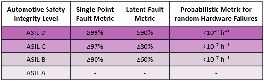
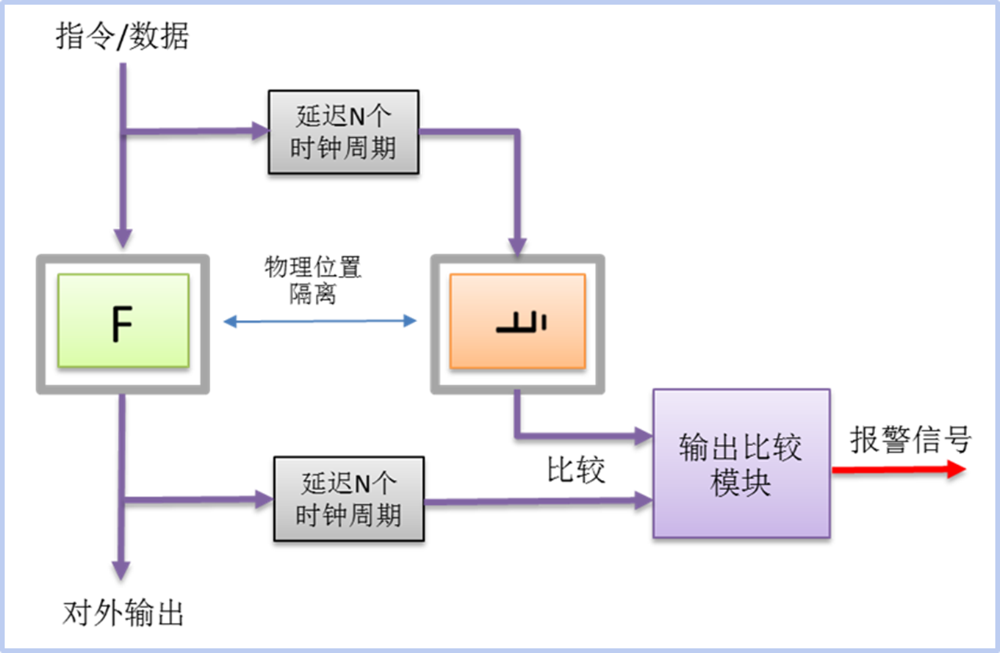
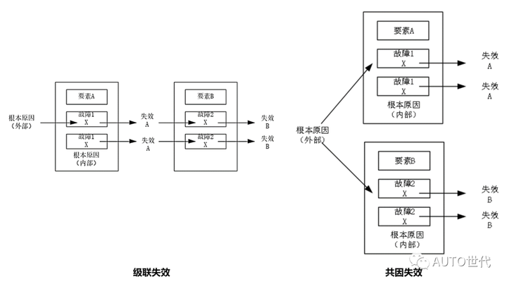
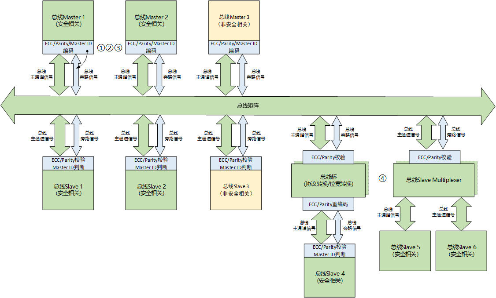
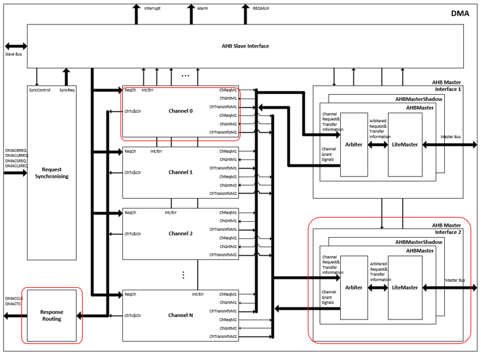
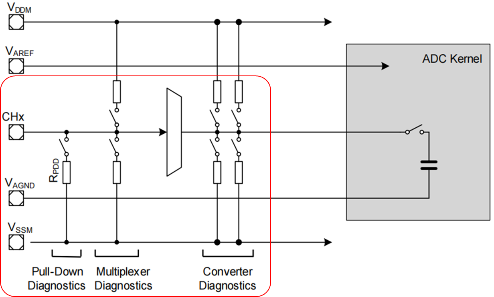
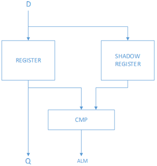
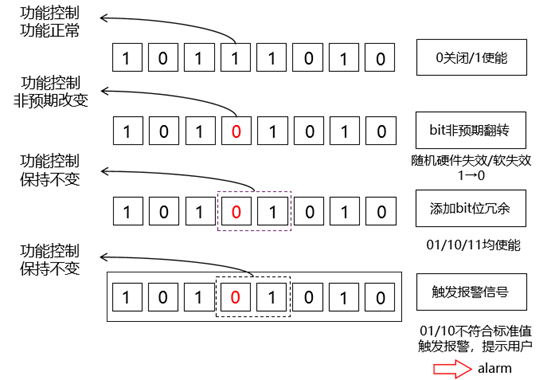
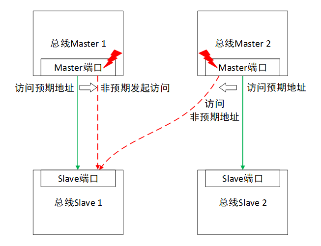

# 一、为什么需要功能安全
## 1.1 系统性失效
汽车开发工程师在汽车E/E系统开发中，包括软件和控制器硬件，不可避免地存在人为疏忽或错误，引起系统功能功能失效，进而导致故障并产生危害。这部分人为疏忽导致的失效为系统性失效。(注: 硬件也有系统失效)

## 1.2 随机硬件失效
控制器硬件，由于自身老化，外部环境因素等引发功能失效，导致相应故障并产生危害。硬件失效带有随机性，符合一定概率分布，因此称为硬件随机失效。

# 二、功能安全解决什么问题？
- 除通常质量管理(QM)外，对汽车E/E系统软硬件全生命周期安全开发流程，方法等进行约束和规范(主要是通过ASIL)，尽可能降低人为结构性的系统失效
- 对控制器硬件部分进行概率化度量，尽可能降低随机硬件失效
- 除过程约束外，设定安全状态，一旦系统发生故障，在故障容错时间内将系统导入安全状态，避免对人身、财产造成伤害

# 三、

# 附录
## 功能安全实现落地
1. 识别不合理的风险
识别不合理的风险的功能安全开发活动称为“**危害分析与风险评估**”
   - 识别相关项所有功能异常所有行为可能导致的整车危害；
  - 结合危害和危害发生时刻车辆运行的场景来分析风险，从而确定安全目标。

2. 降低不合理的风险
   - 需要对能引起不合理的风险的功能进行功能安全开发，尽可能避免功能异常发生的概率或功能异常所能造成的风险严重程度；
   - 世界上没有100%安全的产品，功能异常不可能100%避免，功能安全追求的是将功能异常的可能性控制在合理的（或者说可接受的）范围内，本质上就是将**系统性失效和随机硬件失效**控制在可接受的范围内。

(**系统性失效（systematic failure）**：以确定的方式与某个原因相关的失效，只有对设计或生产流程、操作规程、文档或其他相关因素进行变更后才可能排除这种失效。
**随机硬件失效(random hardware failure)**：在硬件要素的生命周期中，非预期发生并服从概率分布的失效。)

3. 对于随机硬件失效的控制，ISO 26262从以下两个维度提出了要求：
   1. 硬件架构度量的评估：
      - 显示用于防止硬件架构中单点或残余故障风险的安全机制的覆盖率是否足够(单点故障度量/SPFM)
      - 显示用于防止硬件架构中潜伏故障风险的安全机制的覆盖率是否足够(潜伏故障度量/LFM)
   2. 随机硬件失效导致违背安全目标的评估
      - 确定违背安全目标的残余风险已经足够低(PMHF)
(芯片的**失效率**，是基于单个晶体管在某个工艺节点的失效概率，推导出片上逻辑或者内存的失效概率。 面积越大，晶体管越多，相应的失效率越大。 ISO26262把安全等级做了划分，常见的有ASIL-B和ASIL-D级。 ASIL-B要求芯片能够覆盖90%的单点失效场景，而ASIL-D则是99%。 这其实是个非常高的要求。 一个晶体管的失效概率虽低，可是通常一个复杂芯片是上亿个晶体管组成的，如果不采取任何措施，那任何一点的错误都可能造成功能失效，失效率很高。)

图 0

 

## 常见安全机制介绍
### 相关概念
1. 安全措施
用以避免或控制系统性失效、探测随机硬件失效，控制随机硬件失效或减轻它们的有害影响的活动或技术解决方案。（安全措施包括安全机制）

2. 安全机制
为了达到或保持某种安全状态，由电子电气系统的功能或要素或其他技术来实施的技术解决方案，以探测故障、控制失效。
注：实施安全机制用以避免故障导致单点失效或减少残余失效，并防止故障潜伏

3. 安全机制时间属性
故障容忍时间：系统中从出现故障到危害事件发生的时间间隔
故障检测时间：从故障发生到探测到故障的时间间隔
故障响应时间：从故障探测到进入安全状态的时间间隔
故障处理时间：故障检测时间与故障响应时间之和
注：**故障处理时间应小于故障容忍时间**

4. 诊断覆盖率
硬件要素失效率中，由实施的安全机制探测或控制的失效率所占的比例（另一种解释：指元器件失效率可以被安全机制诊断出来的百分比， 典型值：60%、90%和 99%。）

5. uC安全机制分类
基于纯硬件电路的安全机制
基于硬件+软件结合的安全机制
基于系统级电路设计的安全机制

### CPU相关安全机制
1. CPU双核锁步校验
   - **基本原理**：主核与影子核采用相同电路设计，接收同一输入数据，各自使用独立的时钟及复位信号*，其中影子核的输入信号作延迟两拍处理，主核的输出信号做延迟两怕处理，并在外部比较器中进行一致性校验，如比较结果不同，则通过比较器对外输出报警信号。
   - **看护的失效模式**：绝大部分数字逻辑故障
   - **典型诊断覆盖率**：99%
   - **备注**：
     - 两拍延迟是为了防止两个核在同一时刻因为电流或者电磁干扰导致出现了同样的问题，而对比结果一致就认为没有错误的问题。将两个核执行的顺序稍微错位，执行的内容还是一致的，就能避免以上问题。
     - CPU双核锁步校验**增加了数字逻辑部分的面积开销，但节省了基于软件的自检校验工作，同时不影响功能软件的正常执行与时间周期**，保证了软件无感情况下，实现较高的功能安全等级，因此成为了主流的ASIL-D等级CPU的设计方案。

图 1

 

2. CPU软件自检校验
   - **基本原理**：通过特定的测试Pattern并结合硬件电路结构，在CPU各功能逻辑处执行诊断相关的程序，并观察是否为预期的输出结果
   - **看护的失效模式**：数字逻辑卡滞故障
   - **典型诊断覆盖率**：90%(寄存器失效)/76.25%(网表端口失效)
   - **备注**：
     - 软件自检程序能够有效的检测出逻辑电路中的卡滞故障，但对于跳变故障，桥接故障以及瞬态失效的诊断能力较差；
     - 软件自检的执行会干扰到功能程序的运行，导致同一核中两者无法并行开展，从而增加了CPU软件负载，同时由于自检程序部分与被诊断的功能部分运行在同一硬件环境上，因此受共因失效影响较大。
     - 当前软件自检校验主要为面积敏感型（大算力芯片）以及ASIL等级较低（ASIL-B）的CPU安全设计方案
(共因失效：由单一特定事件或根本原因直接导致一个相关项中两个或多个要素的失效，该事件或根本原因可来自所有这些要素的内部或外部。
级联失效：由一个根本原因（来自要素内部或外部）导致某个相关项的要素的失效，进而引起相同或不同相关项的另一个要素或多个要素的失效。)

图 2

 

### FLASH/RAM相关安全机制
1. 存储数据ECC校验
   - **基本原理**：针对写入的数据，根据选定的纠检错算法进行编码（如32+7/64+8等），并将校验码与数据共同存放在地址所对应区域，并在数据读出时进行对应的解码，并根据检测结果判定故障类型。
   - **看护的失效模式**：存储Cell卡滞/存储Cell非预期翻转/Bitline短路/开路等
   - **典型诊断覆盖率**：99%或参考应用的检错算法
   - **备注**：
     - 常见的纠检错能力为：RAM：SECDED；DFLASH/PFLASH：DECTED
     - 为保证故障信息的保存及追溯，需针对检测到的故障地址进行记录，通常针对可修复故障的地址记录数量为5个，针对不可修复故障的地址记录数量为1个
     - 为便于故障分析及ECC机制的功能校验，通常设计有特殊的访问通路，实现对ECC校验信号的读写访问（避免由于ECC信号对用户不可见导致无法校验ECC机制的有效性）

2. 存储地址译码校验
   - **基本原理**：在进行校验码计算时，将数据信号与写地址信号共同考虑进去，将两者拼接后生成对应的ECC校验码，并将ECC校验码与数据共同存入；在数据读出时，将接收到的读地址信号与读数据做拼接处理后进行ECC校验，当存在ECC错误且落在地址信号区域时，则判定为不可修复故障
   - **看护的失效模式**：地址译码相关逻辑失效
   - **典型诊断覆盖率**：99%
   - **备注**：
     - 该机制可以有效的看护由于地址译码失效，导致读出错误地址的数据，且由于数据与校验码相匹配，而无法被数据ECC校验方式所检测出的情况

3. 存储数据白噪声（White Noise）看护
   - **基本原理**：当数据与ECC校验码为全1/全0组合时，判定为不可修复的故障情况
   - **看护的失效模式**：由于wordline相关故障（短路/断路/未选/多选），导致IO端口返回全0或全1值
   - **典型诊断覆盖率**：99%
   - **备注**：
     - 需在ECC算法IP选择时，确认全1/全0数据所对应的ECC校验码是否为全1/全0
     - 需避免由于软件访问到Flash擦除区域时，而触发的全1故障误报（应限制软件访问到Flash擦除区）

### 总线相关安全机制
1. 总线信号ECC校验
   - **基本原理**：通过ECC编码方式针对总线数据/地址/控制信号进行看护，校验码通过总线旁路通道进行传递
   - **看护的失效模式**：数据/地址/控制信号错误
   - **典型诊断覆盖率**：99%
   - **备注**：
     - 通常数据/地址编码方式为32+7/64+8，多个控制信号做拼接处理进行ECC校验码计算

2. 总线信号Parity校验
   - **基本原理**：通过Parity编码方式针对总线握手信号进行看护，校验码通过总线旁路通道进行传递
   - **看护的失效模式**：握手信号错误
   - **典型诊断覆盖率**：60%-90%
   - **备注**：
     - 由于Parity校验本质为信号中的奇/偶数数量，因此针对多bit信号的诊断覆盖率较低，而对于单bit信号看护具有较高的诊断覆盖率（等效于信号冗余）

3. 总线Slave访问看护
   - **基本原理**：通过在总线Slave端配置不同总线Master的访问权限，并对接收到的Master ID信号进行比较，从而判断当前总线访问是否允许并返回对应的xRESP信号类型（Okay/Error）
   - **看护的失效模式**：总线矩阵路由错误
   - **典型诊断覆盖率**：99%

4. 总线桥逻辑/Slave Multiplexer冗余校验
   - **基本原理**： 对总线桥模块或总线Slave Multiplexer进行冗余设计，两者采用相同的输入，并针对输出信号进行一致性比较
   - **看护的失效模式**：协议/位宽转换错误、地址译码/选通错误
   - **典型诊断覆盖率**：99%
   - **备注**：
     - 由于涉及到总线协议/位宽转换，总线信号ECC/Parity校验校验信号并不能完整的进行端到端传递，因此通常在总线桥前级进行解码操作，并在总线桥后级进行新的编码操作，而总线桥则通过硬件冗余方式保证功能电路的完整性（看护协议转换错误，保证后级编码数据的正确）

图 3

 

### DMA相关安全机制
1. DMA逻辑电路冗余校验
   - **基本原理**：对DMA Master端接口电路进行冗余设计，两者采用相同的输入，并针对输出信号进行一致性比较，从而避免由于Master端口电路故障导致发起错误的DMA读写传输
   - **看护的失效模式**：控制逻辑错误
   - **典型诊断覆盖率**：99%

2. DMA数据搬运CRC校验
   - **基本原理**：将从源端读到的数据，基于Byte颗粒度进行CRC计算，并在对目的端进行数据搬运时，对写数据进行CRC校验，从而检查数据在DMA内部进行处理时是否存在丢失或错误的情况
   - **看护的失效模式**：数据搬运错误/丢失
   - **典型诊断覆盖率**：60%-90%
   - **备注**：
     - CRC校验诊断覆盖率与数据搬运长度有关，诊断覆盖率随着数据搬运长度的增加而减少

3. DMA握手超时校验
   - **基本原理**：当外设模块发起DMA请求后，检测到DMA是否在规定时间内返回预期的响应信号
   - **看护的失效模式**：DMA响应丢失
   - **典型诊断覆盖率**：90%
   - **备注**：
     - 该机制通常在发起DMA请求的模块端实现

4. DMA请求冲突校验
   - **基本原理**：当外设模块发起DMA请求且未被清除前，检测是否再次置起相同的DMA请求信号
   - **看护的失效模式**：DMA请求丢失
   - **典型诊断覆盖率**：90%
   - **备注**：
     - 该机制主要适用于，当DMA请求丢失后，无法再次自动置位的情况
     - 该机制通常在发起DMA请求的模块端实现

图 4

 

### ADC相关安全机制
1. ADC通道短路诊断
   - **基本原理**：通过上下拉电阻，将采样通道依次连接到电源端/地端，从而完成对内部电容的充放电过程，并根据采样结果的变化来判断当前ADC内部通道连接的完整性
   - **看护的失效模式**：ADC采样通道断路
   - **典型诊断覆盖率**：90%

2. ADC多路转换器诊断
   - **基本原理**：将ADC采样通道的MUX输入端口通过上下拉电阻连接到已知的参考电压上，通过特定的切换序列判断MUX选通功能是否正常
   - **看护的失效模式**：MUX卡滞/选通错误
   - **典型诊断覆盖率**：90%
   - **备注**：
     - 由于该诊断方案的使用会影响到正常模拟采样工作，因此该诊断通常在上电阶段使用，用于ADC的初始化自检

3. ADC模数转换诊断
   - **基本原理**：ADC采样通道可通过上下拉电阻将已知的参考电压接入到模数转换器中，并通过观察转换结果与预期值是否一致来判断模数转换功能是否正常
   - **看护的失效模式**：模数转换错误/卡滞
   - **典型诊断覆盖率**：90%
   - **备注**：
     - 由于该诊断方案的使用会影响到正常模拟采样工作，因此该诊断通常在上电阶段使用，用于ADC的初始化自检

4. ADC采样阈值诊断
   - **基本原理**：ADC针对模拟采样结果具有阈值检测机制，当模拟转换数字结果超出用户设置的阈值时，则产生警报信号
   - **看护的失效模式**：模数转换过高/过低
   - **典型诊断覆盖率**：90%
   - **备注**：
     - 该机制诊断覆盖率的高低与阈值设置范围有关，阈值上下限设置的越贴近真实信号范围，则诊断覆盖率相对越高

图 5

 

### 寄存器相关安全机制
1. 寄存器整体冗余
   - **基本原理**：通过主寄存器与影子寄存器进行实时比较的方式实现寄存器整体冗余，比较结果不一致时输出报警信号（影子bit位用户不可见）
   - **看护的失效模式**：寄存器值卡滞/非预期翻转
   - **典型诊断覆盖率**：99%
   - **备注**：
     - 通常寄存器整体冗余机制用范围：检测阈值配置等安全相关配置寄存器；参数配置、关键结果记录等重要的功能配置/结果寄存器

图 6

 

2. 寄存器位域冗余
   - **基本原理**：通过将单bit控制位进行扩展的方式实现寄存器冗余，当寄存器值与预期值不一致时输出报警信号，并保持预期功能（冗余bit位用户可见）
   - **看护的失效模式**：寄存器值卡滞/非预期翻转
   - **典型诊断覆盖率**：99%
   - **备注**：
     - 通常寄存器位域冗余机制用范围：安全机制使能、故障注入使能、报警信号屏蔽等安全相关控制寄存器；模块使能、模块复位、时钟控制等重要的功能控制寄存器
     - 寄存器位域冗余方式可有效的避免功能被非预期改变，因此一般推荐使用该冗余方式

图 7

 

3. 寄存器访问保护
   - **基本原理**：只有正确解锁对应的寄存器访问信号后，才能对目标寄存器进行写操作，否则写操作无效
   - **看护的失效模式**：总线Master发起非预期写操作
   - **典型诊断覆盖率**：90%
   - **备注**：
     - 通常寄存器访问保护的适用范围：准静态寄存器：上电进行一次配置后无需在运行时再次进行配置；系统关键寄存器：使能后直接打断现有功能运行状态（复位控制、时钟使能等）

图 8

 

### 系统级相关安全机制
1. ADC/IO通道冗余使用
   - **基本原理**：通过两路通道对同一模拟信号进并使用应用软件对其进行差异性比较，判定信号采样的正确性；通过一路IO通道对外部负载进行控制输出，使用另一路IO进行回采校验，并通过软件判定输出信号的正确性
   - **看护的失效模式**：功能整体错误（如ADC转换器错误，IO控制逻辑错误等）
   - **典型诊断覆盖率**：99%
   - **备注**：
     - 由于无法利用内部电路针对ADC采样或IO输出结果的正确性进行校验，因此通常使用冗余校验的方式对其进行失效看护

2. GTM输出冗余校验
   - **基本原理**：通过一路TOM通道针对目标驱动提供控制输出，并通过TIM通道在内部进行信号回采比较
   - **看护的失效模式**：GTM输出信号错误
   - **典型诊断覆盖率**：90%

3. E2E校验
   - **基本原理**：可以基于应用软件通过车载总线端到端的校验方式，用于保护通信模块的整体失效、
   - **看护的失效模式**：由于硬件电路/软件自身问题导致的通信错误
   - **典型诊断覆盖率**：90%-99%
   - **备注**：
     - 完整的E2E校验机制包含如下四种方式：Checksum校验、Rolling Counter校验、Timeout校验、Alive校验

4. 程序流监控
   - **基本原理**：用户可以利用AUTOSAR中的WdgM模块进行程序流监控，程序流监控的诊断覆盖率与所采用的监控方式复杂度有关
   - **看护的失效模式**：由于硬件电路/软件自身问题导致的程序执行错误
   - **典型诊断覆盖率**：90%-99%
   - **备注**：
     - Autosar WdgM中具有如下三种监控方式：Alive Supervision、Deadline Supervision、Logical Supervision

5. 外部看门狗/uC故障信号外部监控
   - **基本原理**：芯片运行过程中，需利用外部独立看门狗对芯片状态进行监控，用于看护系统时钟、故障响应路径错误等芯片自身无法处理的失效事件
   - **看护的失效模式**:由于硬件电路/软件自身问题导致的芯片
   - **典型诊断覆盖率**：90%