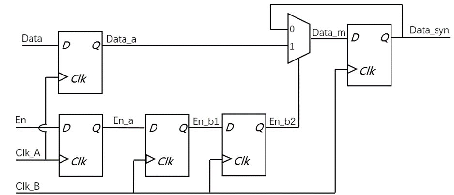
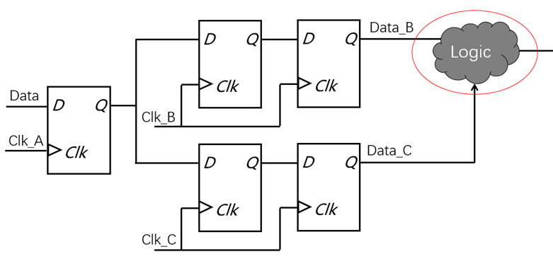

# 1.亚稳态
* 产生原因：
    * 跨时钟域数据不满足目标时钟的建立保持时间
    

图 1

 
* 解决方案：
    * 两级或多级同步器隔离亚稳态
>* 亚稳态无法消除
>* 亚稳态只能被隔离，降低发生概率
>* 两级同步器之间不要有组合逻辑

图 2

 

# 2.数据保持（快时钟域到慢时钟域）

图 3

 

- 产生原因：
    * 数据从快时钟域到慢时钟域
    * 数据**保持的时间较短**，无法被慢时钟域采样
* 解决方案：
    * 数据展宽 (单bit)
        - 

图 4

 

    * 脉冲同步器 (单bit)
        * 

图 5

 
        * 

图 6

 
        * 1. 将clock1时钟域的输入脉冲转换为clock1时钟域的电平信号；
        * 2. 对电平信号进行打拍（打两拍）同步到clock2时钟域；
        * 3. 对clock2时钟域的电平信号进行检测，产生clock2时钟域的脉冲信号；

# 3.数据冗余（慢时钟域到快时钟域）

图 7

 

* 产生原因：
    * 数据从慢时钟域到快时钟域
    * 数据在目标时钟域被**多次采样**
* 解决方案：
    * 边沿检测 (单bit)
        * 

图 8

 
        * 

图 9

 
        * 两个同步的触发器，将其他时钟域信号同步到clock A的时钟域中
        * 一个触发器加一个逻辑门， 逻辑门的两个输入引脚差了一个时钟周期

# 4.数据相关性丢失
* 产生原因：
    * 延迟与时钟不确定性令目标时钟域采样无效数据
    

图 10

 
* 解决方案：
    * 多位**控制信号**：格雷码编码
        * 相邻数据间转换时，只有**一位**产生变化，地址范围或状态数量为2的n次方个
        * 

图 11

 
    * **数据信号**：
        * 异步FIFO
            * 

图 12

 
            * 读写指针在**格雷码**编码后同步
            * “空信号”在读时钟域产生
            * “满信号”在写时钟域产生
        * 握手协议
            * 

图 13

 
            * “req”信号同步至clk_b；
            * “ack”信号同步至clk_a；
            * 数据保持直到握手完成
            * 

图 14

 
        * 使能信号控制
            * 

图 15

 
            * 

图 16

 

# 5.复位信号的同步（异步复位同步释放）
* 复位时，复位信号不受时钟影响， 可在任意时刻低电平进行复位，不需要与时钟同步；
* 释放时，复位信号释放时，需与时钟信号同步，即刚好跟时钟同沿；
* 

图 17

 

# 6.无毛刺时钟切换（Glitch Free Clock MUX）
* 利用**纯组合逻辑**来设计时钟切换电路，则不可避免产生毛刺；
* 两个时钟的频率相关 
    * 解决方案：在每个时钟源头选择路径上插入一个下降沿有效的D触发器；
    * 

图 18

 

    利用时钟的下降沿寄存选择信号，保证了选择信号不会在两个时钟高电平的时候进行跳变，防止输出时钟被截断。

    * 

图 19

 
* 两个时钟的频率无关
    * 解决方案：异步行为可能来自于select，因此在每个时钟源选择路径上插入一个上升沿有效的D触发器来避免亚稳态
    * 

图 20

 

    利用上升沿触发的寄存器（可以使用两级），寄存选择信号，降低由于异步select导致的亚稳态，同时配合下降沿触发的寄存器，使切换都发生在时钟低电平处。降低毛刺产生的概率。

    * 

图 21

 

# 同步常见错误用例
* 存在信号未同步
    * 

图 22

 
* 两个或多个时钟源的数据在同步之前相遇
    * a. 

图 23

 
    * b. 

图 24

# 跨时钟域处理中10个注意项
1. 使用多级同步

图 24

 

1. 避免合并早期同步阶段的信号

图 25

 

1. 同步前寄存组合信号

图 26

 

1. 考虑亚稳态延迟

图 27

 

1. 确保足够的时钟速率
> 信号发送域中的时钟周期应至少是接收域时钟周期的1.5倍。发送时钟周期过短会导致信号不总是被采样。如果不能满足这个条件，那么最好使用请求-确认机制来控制跨域信号的切换。

1. 永远不要假设同步
> 当使用域中另一个设计器的模块中的网络或总线时，不要假定网络已为您同步。如有必要，请始终检查并使用同步器。

1. 反馈信号

图 28

 

1. 避免同步阶段之间的逻辑
> 避免在同步器的触发器之间放置任何组合逻辑，因为这可能会降低同步器的MTBF。组合逻辑的输出可能会出现毛刺，并导致时序问题，最终导致亚稳态。

图 29

 

1.  软件驱动信号
> 由软件驱动的信号不应在没有同步的情况下用于接收域的逻辑。否则将导致时序违规并导致亚稳态。

1.  同步后不要联合收割机信号
> 接收域中不同同步器的输出无法组合并用于其他地方，因为无法保证它们的同步顺序，因此有可能采样错误的数据。如果两个信号必须在接收域中组合使用，那么最好在发送域中组合它们或使用一些其他方法来克服相干性问题。

图 30

 